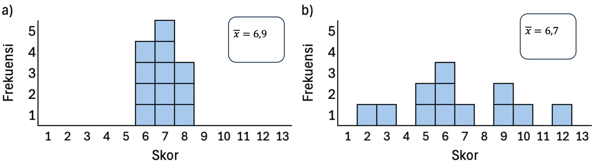

# Ukuran Penyebaran Data {#sec-dispersi}

Setelah mengetahui nilai pusat dari suatu data melalui ukuran pemusatan data, langkah berikutnya adalah memahami seberapa jauh data menyebar dari nilai pusat tersebut. **Ukuran penyebaran data**, atau **dispersi**, memberikan informasi penting tentang variasi atau keragaman dalam kumpulan data. Dua set data bisa memiliki *mean* yang sama, tetapi penyebarannya bisa sangat berbeda, dan perbedaan ini dapat memengaruhi cara interpretasi data secara keseluruhan. Dalam sub-bab ini, akan dibahas beberapa ukuran utama penyebaran, yaitu rentang (*range*), standar deviasi, dan varians, yang membantu menggambarkan tingkat homogenitas atau heterogenitas suatu data secara lebih mendalam.

## *Range*

***Range***, atau rentang data, adalah selisih antara nilai tertinggi dengan nilai terendah dalam sebuah set data. *Range* menunjukkan seberapa **lebar sebaran nilai** dalam data, namun karena hanya mempertimbangkan dua nilai ekstrem, ukuran ini sangat sensitif terhadap *outlier* dan tidak menggambarkan variasi data secara keseluruhan. Meskipun demikian, *range* tetap berguna sebagai gambaran awal tentang sebaran data.

Untuk dapat memahami fungsi *range* dalam memahami set data, mari kita pelajari kasus berikut ini. Misalnya, seorang peneliti memiliki data nilai tugas mata pelajaran Matematika dari 3 kelas yang berbeda:

|         |     |     |     |     |     |     |     |     |     |     |     |
|---------|-----|-----|-----|-----|-----|-----|-----|-----|-----|-----|-----|
| Kelas A |     | 4   | 4   | 6   | 6   | 7   | 4   | 7   | 3   | 5   | 4   |
| Kelas B |     | 2   | 6   | 6   | 7   | 7   | 8   | 4   | 4   | 3   | 3   |
| Kelas C |     | 6   | 5   | 6   | 4   | 5   | 6   | 4   | 4   | 5   | 5   |

Pertanyaan penting mengenai data tersebut adalah apakah ketiga kelas tersebut memperoleh capaian belajar yang sama. Jika hanya mengandalkan nilai rata-rata, maka ketiga kelas tersebut akan tampak sama karena memiliki nilai rata-rata yang sama, yaitu 5. Padahal jika dilihat ke perolehan nilai individual, terlihat berbeda. Nilai *range* pada data dapat membantu kita untuk menggambarkan seberapa berbeda dan bervariasi data yang dimiliki dan makna variasi tersebut dalam memahami setiap poin data. Untuk itu, kita perlu menghitung selisih skor terbesar dengan skor terkecil untuk setiap data kelas.

$$
\begin{aligned}
Range\; kelas\; A &= nilai\; tertinggi - nilai\; terendah = 7 -3 = 4\\
Range\; kelas\; B &= nilai\; tertinggi - nilai\; terendah = 8 -2 = 6\\
Range\; kelas\; C &= nilai\; tertinggi - nilai\; terendah = 6 -2 = 4
\end{aligned}
$$

Dari hasil penghitungan, dapat dilihat bahwa kelas B memiliki lebar data yang paling besar, artinya terdapat perbedaan atau variasi yang lebih besar di dalam kelas tersebut dibandingkan dengan kelas-kelas lainnya. Sebaliknya, kelas C memiliki rentang skor paling kecil di antara ketiganya. Dalam hal ini, satu skor yang sama (misalnya, 4) dapat dimaknai secara berbeda berdasarkan nilai *range* tiap kelas.

Satu hal yang perlu diingat adalah bahwa variasi skor yang digambarkan dalam *range* hanya menunjukkan perbedaan antara yang mendapatkan nilai paling tinggi dan yang mendapatkan nilai paling rendah. Dari nilai *range* tersebut kita tidak memiliki informasi mengenai seberapa besar ukuran variabilitas (atau seberapa bervariasi) sebuah set data. Untuk mendapatkan gambaran ini, kita menggunakan ukuran penyebaran data berikutnya, yaitu varians.

## Varians

**Varians** (*s^2^*) adalah ukuran penyebaran data yang menunjukkan **seberapa jauh nilai-nilai dalam suatu kumpulan data** **menyimpang dari nilai** ***mean***. Varians dihitung dengan menjumlahkan kuadrat selisih setiap nilai (*X*) terhadap *mean* ($\bar{x}$), kemudian dibagi dengan jumlah data (N) (untuk populasi) atau jumlah data dikurangi satu (*n*-1) (untuk sampel). Dapat juga ditulis sebagai:

$$
s^2 = \frac{\sum (X - \bar{x})^2}{N - 1}
$$

Hasil varians menunjukkan “rata-rata kuadrat penyimpangan” dari *mean*, sehingga semakin besar nilai varians, semakin besar pula variasi data di sekitar *mean*. Dengan kata lain, varians juga menggambarkan **homogenitas** data, di mana semakin kecil varians maka semakin kecil perbedaan antar poin data, dan sebaliknya semakin besar varians semakin besar pula perbedaan antar poin data.

Sebagai ilustrasi, misalnya terdapat data set skor skala sikap dari dua kelompok partisipan yang berbeda (a & b), dengan masing-masing sebaran data sebagai berikut:

|            |     |     |     |     |     |     |     |     |     |     |     |     |     |               |
|-----|-----|-----|-----|-----|-----|-----|-----|-----|-----|-----|-----|-----|-----|-----|
| Kelompok a |     | 6   | 6   | 6   | 6   | 7   | 7   | 7   | 7   | 7   | 8   | 8   | 8   | $\bar{x}$=6.9 |
| Kelompok b |     | 2   | 3   | 5   | 5   | 6   | 6   | 6   | 7   | 9   | 9   | 10  | 12  | $\bar{x}$=6.7 |

::: {.content-visible when-format="pdf"}
Untuk dapat memperoleh nilai varians, kita perlu menghitung simpangan atau selisih dari setiap data poin terhadap mean kemudian dikuadratkan, seperti pada **Tabel 8.3**.
:::

::: {.content-visible when-format="pdf"}
```{=latex}
\begin{table}[ht]
\centering
\caption{Perhitungan simpangan dan varians dua kelompok}
\label{tab:rerata}
\setlength{\tabcolsep}{4pt}
\renewcommand{\arraystretch}{1.1}
\resizebox{\textwidth}{!}{%
\begin{tabular}{|c|c|c|c|c|c|}
\hline
\multicolumn{3}{|c|}{\textbf{Kelompok a}} & \multicolumn{3}{c|}{\textbf{Kelompok b}} \\
\hline
\textbf{Skor (X)} & \textbf{Simpangan $(X - \bar{x})$} & \textbf{Kuadrat simpangan $(X - \bar{x})^2$} &
\textbf{Skor (X)} & \textbf{Simpangan $(X - \bar{x})$} & \textbf{Kuadrat simpangan $(X - \bar{x})^2$} \\
\hline
6 & -0.9 & 0.81 & 2  & -4.7 & 22.09 \\
6 & -0.9 & 0.81 & 3  & -3.7 & 13.69 \\
6 & -0.9 & 0.81 & 5  & -1.7 & 2.89  \\
6 & -0.9 & 0.81 & 5  & -1.7 & 2.89  \\
7 & 0.1  & 0.01 & 6  & -0.7 & 0.49  \\
7 & 0.1  & 0.01 & 6  & -0.7 & 0.49  \\
7 & 0.1  & 0.01 & 6  & -0.7 & 0.49  \\
7 & 0.1  & 0.01 & 7  & 0.3  & 0.09  \\
7 & 0.1  & 0.01 & 9  & 2.3  & 5.29  \\
8 & 1.1  & 1.21 & 9  & 2.3  & 5.29  \\
8 & 1.1  & 1.21 & 10 & 3.3  & 10.89 \\
8 & 1.1  & 1.21 & 12 & 5.3  & 28.09 \\
\hline
\multicolumn{2}{|c|}{$\Sigma (X - \bar{x})^2$} & 6.92 & \multicolumn{2}{c|}{$\Sigma (X - \bar{x})^2$} & 92.68 \\
\hline
\multicolumn{2}{|c|}{$s^2 = \dfrac{\Sigma (X - \bar{x})^2}{N-1}$} & 0.6 &
\multicolumn{2}{c|}{$s^2 = \dfrac{\Sigma (X - \bar{x})^2}{N-1}$} & 8.4 \\
\hline
\end{tabular}
} % end resizebox
\end{table}
```
:::

::: {.content-visible when-format="html"}
Untuk dapat memperoleh nilai varians, kita perlu menghitung simpangan atau selisih dari setiap data poin terhadap mean kemudian dikuadratkan, seperti pada @tbl-varians2.
:::

::: {#tbl-varians2 .content-visible when-format="html"}
```{=html}
<!-- ====== CSS (bisa taruh di <head> atau file styles.css) ====== -->
<style>
  .table-wrap {
    max-width: 100%;
    overflow-x: auto;           /* scroll horizontal bila perlu */
    margin: 1rem 0;
    border: 1px solid #bbb;
    border-radius: 6px;
  }
  table.stat {
    width: 100%;
    border-collapse: collapse;
    table-layout: fixed;        /* paksa kolom proporsional -> cegah melebar */
    font-variant-numeric: tabular-nums;
  }
  table.stat th, table.stat td {
    border: 1px solid #999;
    padding: .45rem .5rem;
    text-align: center;
    word-wrap: break-word;      /* boleh patah baris */
    overflow-wrap: anywhere;
  }
  table.stat caption {
    caption-side: top;
    text-align: center;
    font-weight: 600;
    padding: .4rem;
  }
  /* Header baris-1 (Kelompok a/b) */
  table.stat thead tr:first-child th {
    font-weight: 700;
  }
  /* Sedikit rapikan rumus di footer */
  .frac { display:inline-block; vertical-align:middle; line-height:1; }
  .frac .num { display:block; border-bottom:1px solid #000; padding:0 .2em; }
  .frac .den { display:block; padding:0 .2em; }
</style>

<!-- ====== HTML tabel ====== -->
<div class="table-wrap">
  <table class="stat">
<caption>Perhitungan simpangan dan varians dua kelompok</caption>
<thead>
<tr>
<th colspan="3">Kelompok a</th>
<th colspan="3">Kelompok b</th>
</tr>
<tr>
<th>Skor (X)</th>
<th>Simpangan (X − x̄)</th>
<th>Kuadrat simpangan (X − x̄)²</th>
<th>Skor (X)</th>
<th>Simpangan (X − x̄)</th>
<th>Kuadrat simpangan (X − x̄)²</th>
</tr>
</thead>
<tbody>
<tr><td>6</td><td>-0.9</td><td>0.81</td><td>2</td><td>-4.7</td><td>22.09</td></tr>
<tr><td>6</td><td>-0.9</td><td>0.81</td><td>3</td><td>-3.7</td><td>13.69</td></tr>
<tr><td>6</td><td>-0.9</td><td>0.81</td><td>5</td><td>-1.7</td><td>2.89</td></tr>
<tr><td>6</td><td>-0.9</td><td>0.81</td><td>5</td><td>-1.7</td><td>2.89</td></tr>
<tr><td>7</td><td>0.1</td><td>0.01</td><td>6</td><td>-0.7</td><td>0.49</td></tr>
<tr><td>7</td><td>0.1</td><td>0.01</td><td>6</td><td>-0.7</td><td>0.49</td></tr>
<tr><td>7</td><td>0.1</td><td>0.01</td><td>6</td><td>-0.7</td><td>0.49</td></tr>
<tr><td>7</td><td>0.1</td><td>0.01</td><td>7</td><td>0.3</td><td>0.09</td></tr>
<tr><td>7</td><td>0.1</td><td>0.01</td><td>9</td><td>2.3</td><td>5.29</td></tr>
<tr><td>8</td><td>1.1</td><td>1.21</td><td>9</td><td>2.3</td><td>5.29</td></tr>
<tr><td>8</td><td>1.1</td><td>1.21</td><td>10</td><td>3.3</td><td>10.89</td></tr>
<tr><td>8</td><td>1.1</td><td>1.21<td>12</td><td>5.3</td><td>28.09</td></tr>
<!-- Baris Σ -->
<tr>
<td colspan="2">Σ(X − x̄)²</td>
<td>6.92</td>
<td colspan="2">Σ(X − x̄)²</td>
<td>92.68</td>
</tr>
<!-- Baris Varians -->
<tr>
<td colspan="2">
s² =
<span class="frac">
<span class="num">Σ(X − x̄)²</span>
<span class="den">N − 1</span>
</span>
</td>
<td>0.6</td>
<td colspan="2">
s² =
<span class="frac">
<span class="num">Σ(X − x̄)²</span>
<span class="den">N − 1</span>
</span>
</td>
<td>8.4</td>
</tr>
</tbody>
</table>
</div>
```
:::

Dari hasil penghitungan tersebut, kita menemukan perbedaan varians yang cukup besar antara kedua kelompok, meskipun *mean* keduanya tidak jauh berbeda. Hal ini menandakan bahwa kelompok b memiliki sebaran data yang jauh lebih beragam (heterogen) dibandingkan kelompok a (lihat @fig-varians). Oleh karena itu, pemaknaan terhadap nilai *mean* tiap kelompok juga berbeda, relatif terhadap variansnya masing-masing.

Varians memiliki fungsi penting dalam memahami keragaman atau variasi data di sekitar nilai rata-rata. Informasi ini sangat berguna untuk a) menilai konsistensi data (misalnya, dua kelompok dengan rata-rata yang sama bisa memiliki varians yang berbeda; kelompok dengan varians kecil berarti anggotanya lebih homogen.) dan b) dasar dari analisis statistik lanjutan, di mana varians menjadi komponen penting dalam berbagai teknik analisis, seperti standar deviasi, analisis varians (*ANOVA*), uji-t, dan regresi. Dengan demikian, varians bukan hanya ukuran penyebaran, tetapi juga alat untuk mengevaluasi struktur dan kualitas data sebelum melakukan interpretasi atau pengambilan keputusan lebih lanjut.

## Standar Deviasi

**Standar deviasi** (*s*) adalah ukuran penyebaran data yang menunjukkan **rata-rata penyimpangan (deviasi) nilai data dari *mean***. Ukuran ini memberikan gambaran yang lebih intuitif tentang seberapa besar variasi dalam data. Artinya, semakin besar standar deviasi, semakin lebar sebaran data dari nilai tengahnya. Standar deviasi diperoleh dengan mengambil akar kuadrat dari varians:

$$
s = \sqrt{s^2}
$$

Dengan menggunakan data pada pembahasan varians, kita dapat menghitung standar deviasi dari data tiap kelompok, yaitu:

Kelompok a: $s = \sqrt{s^2} = \sqrt{0.6} = 0.77$

Kelompok a: $s = \sqrt{s^2} = \sqrt{8.4} = 2.90$

Hasil penghitungan standar deviasi di atas memperkuat pemahaman bahwa Kelompok a lebih homogen (*s* = 0,77) dibandingkan Kelompok b yang lebih bervariasi (*s* = 2,90). Meskipun informasi ini serupa dengan yang diperoleh dari varians (0,6 *vs* 8,4), standar deviasi lebih mudah diinterpretasikan karena satuannya kembali ke satuan asli data, tidak dalam bentuk kuadrat seperti varians. Dengan demikian, standar deviasi memberikan gambaran yang lebih intuitif tentang jarak rata-rata setiap data dari *mean*, sehingga lebih sering digunakan dalam pelaporan dan interpretasi hasil statistik.

{#fig-varians fig-align="center"}

:::: {.content-visible when-format="html"}
::: callout-tip
## Simulasi Interaktif

```{=html}
<div class="stats-card">
  <h2>📊 Menghitung Persebaran Data</h2>
  <p class="desc">Pilih cara input data, lalu hitung Mean, Varians, dan Standar Deviasi.</p>

  <label><input type="radio" name="mode" value="generate" checked> Generate angka acak (n=40, 20–50)</label><br>
  <label><input type="radio" name="mode" value="manual"> Masukkan data sendiri</label>

  <div style="display:flex; gap:8px; margin-top:8px; flex-wrap:wrap; align-items:center;">
    <button id="genBtn" class="btn primary" style="flex:1;">🎲 Generate Data</button>
    <button id="resetBtn" class="btn danger small">🔁 Reset</button>
  </div>

  <textarea id="dataBox" rows="10" placeholder="Data akan muncul di sini setelah di-generate..."></textarea>

  <button id="calcBtn" class="btn secondary">📈 Hitung Mean • Varians • SD</button>

  <div id="out" class="result-box">Siap menghitung…</div>
</div>

<style>
  .stats-card {
    max-width: 520px;
    background: #ffffff;
    padding: 20px;
    border-radius: 14px;
    box-shadow: 0 4px 18px rgba(0,0,0,0.08);
    font-family: system-ui, sans-serif;
    color: #222;
    margin: 12px auto;
  }
  .stats-card h2 {
    margin-top: 0;
    font-size: 2.2rem;
    color: #4a3aff;
  }
  .stats-card .desc {
    font-size: 1.5rem;
    color: #555;
    margin-bottom: 12px;
  }
  .stats-card textarea {
    width: 100%;
    border: 1px solid #ccc;
    border-radius: 10px;
    padding: 10px;
    margin: 8px 0;
    font-size: 1.4rem;
    font-family: monospace;
    resize: vertical;
    transition: background 0.2s ease;
  }
  .textarea-readonly {
    background: #f0f0f0;
  }
  .textarea-editable {
    background: #f8f8ff;
  }
  .btn {
    padding: 12px;
    font-size: 1.4rem;
    font-weight: 600;
    border: none;
    border-radius: 10px;
    cursor: pointer;
    transition: transform 0.1s ease, box-shadow 0.2s ease;
  }
  .btn.primary {
    background: linear-gradient(135deg, #4a3aff, #6c63ff);
    color: white;
  }
  .btn.secondary {
    background: linear-gradient(135deg, #ff9800, #ffc107);
    color: white;
    width: 100%;
  }
  .btn.danger {
    background: linear-gradient(135deg, #e53935, #ef5350);
    color: white;
  }
  .btn.small {
    padding: 8px 14px;
    font-size: 1.3rem;
    flex: 0 0 auto;
  }
  .btn:hover {
    transform: translateY(-2px);
    box-shadow: 0 4px 10px rgba(0,0,0,0.15);
  }
  .result-box {
    background: #f0f4ff;
    border-left: 5px solid #4a3aff;
    padding: 12px;
    border-radius: 8px;
    margin-top: 12px;
    font-family: monospace;
    font-size: 1.4rem;
    white-space: pre-wrap;
    color: #333;
  }
  @media (max-width: 480px) {
    .stats-card { padding: 16px; }
    .stats-card h2 { font-size: 1.8rem; }
    .stats-card .desc { font-size: 1.2rem; }
    .stats-card textarea { font-size: 1.2rem; }
    .btn { font-size: 1.2rem; width: 100%; }
    .btn.small { width: 100%; }
    .stats-card div[style*="display:flex"] { flex-direction: column !important; }
  }
</style>

<script>
(function(){
  const $ = id => document.getElementById(id);
  const N = 40, MIN = 20, MAX = 50;

  function randInt(min, max){ return Math.floor(Math.random()*(max-min+1))+min; }
  function parseNums(text){
    if(!text) return [];
    return text.trim().split(/[\s,;]+/).map(Number).filter(v => Number.isFinite(v));
  }
  function mean(a){ return a.reduce((s,v)=>s+v,0)/a.length; }
  function variance(a){
    const m = mean(a);
    return a.reduce((s,v)=>s+Math.pow(v-m,2),0)/(a.length-1);
  }
  function stdev(a){ return Math.sqrt(variance(a)); }

  // Inisialisasi
  document.addEventListener('DOMContentLoaded', () => {
    $('dataBox').readOnly = true;
    $('dataBox').classList.add('textarea-readonly');
    $('out').textContent = "Mode Generate: klik 🎲 untuk membuat data acak.";
  });

  // Ganti mode
  document.querySelectorAll('input[name="mode"]').forEach(radio=>{
    radio.addEventListener('change', ()=>{
      const mode = document.querySelector('input[name="mode"]:checked').value;
      if(mode === "generate"){
        $('dataBox').readOnly = true;
        $('dataBox').classList.add('textarea-readonly');
        $('dataBox').classList.remove('textarea-editable');
        $('dataBox').value = "";
        $('dataBox').placeholder = "Data akan muncul di sini setelah di-generate...";
        $('genBtn').textContent = "🎲 Generate Data";
        $('out').textContent = "Mode Generate: klik 🎲 untuk membuat data acak.";
      } else {
        $('dataBox').readOnly = false;
        $('dataBox').classList.add('textarea-editable');
        $('dataBox').classList.remove('textarea-readonly');
        $('dataBox').value = "";
        $('dataBox').placeholder = "Ketik atau tempel (paste) angka di sini, satu angka bulat per baris...";
        $('genBtn').textContent = "⌨️ Gunakan Data";
        $('out').textContent = "Mode Manual: masukkan data (hanya angka bulat), 1 angka per baris.";
      }
    });
  });

  // Tombol Generate / Gunakan Data
  $('genBtn').addEventListener('click', ()=>{
    const mode = document.querySelector('input[name="mode"]:checked').value;
    if(mode === "generate"){
      const arr = Array.from({length:N}, ()=>randInt(MIN,MAX));
      $('dataBox').value = arr.join('\n');
      $('out').textContent = `Data acak dibuat (${N} angka, rentang ${MIN}–${MAX}). Klik 📈 Hitung untuk melihat hasil.`;
    } else {
      $('out').textContent = "Masukkan data (hanya angka), 1 angka per baris.";
    }
  });

  // Batasi input di mode manual
  $('dataBox').addEventListener('input', ()=>{
    const mode = document.querySelector('input[name="mode"]:checked').value;
    if(mode === "manual"){
      let cleaned = $('dataBox').value.replace(/[^0-9\s]/g, "");
      cleaned = cleaned.replace(/[\s,]+/g, "\n");
      $('dataBox').value = cleaned;
    }
  });

  // Tombol Reset
  $('resetBtn').addEventListener('click', ()=>{
    $('dataBox').value = "";
    $('out').textContent = "Siap menghitung…";
  });

  // Hitung statistik
  $('calcBtn').addEventListener('click', ()=>{
    const arr = parseNums($('dataBox').value);
    if(arr.length<2){ $('out').textContent='Data terlalu sedikit atau tidak valid.'; return; }
    const m = mean(arr);
    const v = variance(arr);
    const sd = stdev(arr);
    $('out').textContent =
      `n       : ${arr.length}
Mean    : ${m.toFixed(2)}
Varians : ${v.toFixed(2)}
Std Dev : ${sd.toFixed(2)}`;
  });
})();
</script>
```
:::
::::

:::: {.content-visible when-format="pdf"}
::: callout-tip
## Simulasi Interaktif

### Simulasi Persebaran Data {.unnumbered}

\qrcode[height=3.0cm]{https://bit.ly/49cEy3x}

\vspace{1cm}

\small\textit{Scan QR atau klik \href{https://bit.ly/49cEy3x}{link ini} untuk membuka simulasi interaktif.}
:::
::::
