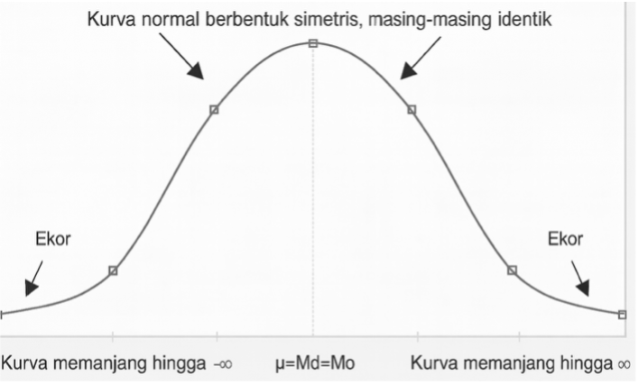
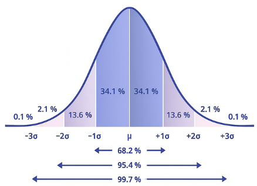
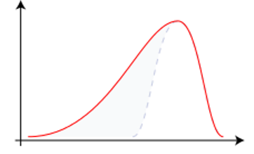
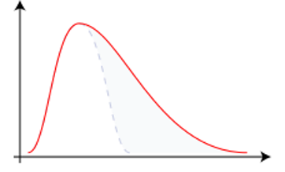
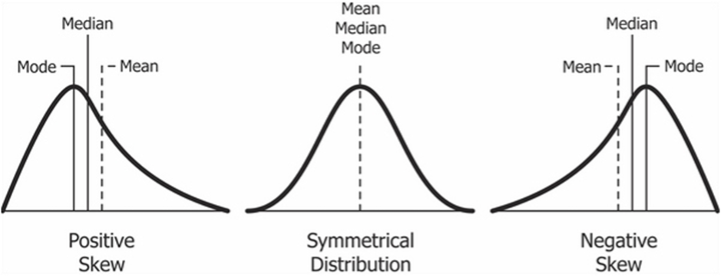
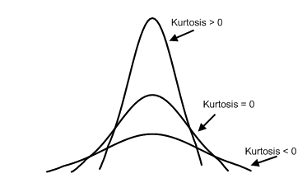

# Bentuk Distribusi Data {#sec-distribusi}

Setiap nilai dalam sekumpulan data memiliki frekuensi kemunculan yang berbeda-beda; nilai ekstrem biasanya muncul lebih jarang, sedangkan nilai yang mendekati *mean* lebih sering muncul. Pola ini membentuk **distribusi data**, yang jika digambarkan dalam grafik seperti poligon frekuensi, akan membentuk kurva. Pada distribusi yang ideal, yaitu **distribusi normal**, kurva berbentuk lonceng (***bell-shaped***) dan **simetris** di sekitar nilai ukuran pemusatan data seperti *mean* atau median \[[@Field2018; @Gravetter2017]. Namun, pada kenyataannya, data bisa saja miring (*skewed*) jika nilai-nilai terkonsentrasi di satu sisi, atau memiliki kurtosis jika kurvanya lebih runcing atau lebih datar dari distribusi normal. Pemahaman tentang bentuk distribusi ini penting karena banyak analisis statistik, terutama yang bersifat inferensial, mengasumsikan bahwa data terdistribusi normal. Untuk itu, bagian-bagian berikut akan membahas lebih lanjut mengenai **kurva normal**, ***skewness***, **kurtosis**, dan ***z-score*** sebagai alat untuk menstandarkan data.

## Kurva Normal

Seperti telah disampaikan sebelumnya, distribusi data dapat dikatakan normal jika kurvanya membentuk lonceng dan simetris. Pada distribusi data yang demikian, frekuensi dari setiap nilai **data tersebar secara simetris** antara yang terletak di atas tendensi sentral dan yang di bawah tendensi sentral. Data tersebar 50% di atas dan 50% di bawah tendensi sentral, dengan frekuensi yang semakin mengecil pada nilai data yang semakin ekstrem, baik yang kecil maupun yang besar (lihat @fig-kurva).

{#fig-kurva fig-align="center" width="380"}

Pada kurva normal, tiga pengukuran data terpusat (*mean*, median, dan modus) berada pada satu titik atau nilai yang relatif sama. Dari @fig-kurva dapat lebih terlihat jelas bahwa 50% data tersebar di atas tendensi sentral dan 50% data tersebar di bawah tendensi sentral, di mana semakin jauh dari tendensi sentral maka semakin sedikit frekuensinya.

Untuk menjawab masalah-masalah tertentu, kita perlu mencari besaran frekuensi sebuah nilai atau cakupan nilai berdasarkan sebaran data yang ada. Misalnya, kita ingin memperkirakan ada berapa jumlah mahasiswa yang nilai ujiannya antara 70 dan 85, di mana nilai *mean* = 80 *SD* = 5, dan *N* = 250. Dengan memanfaatkan informasi standar deviasi (*s*), proporsi frekuensi data pada distribusi normal dapat kita hitung berdasarkan luas area dalam kurva. @fig-proporsi menunjukkan besaran proporsi frekuensi pada data dilihat dari luas area berdasarkan nilai standar deviasi.

{#fig-proporsi fig-align="center" width="350"}

Dari kurva normal yang ditampilkan pada Gambar 3.3, kita dapat mengetahui bahwa setiap belahan kurva dibagi menjadi 4 area berdasarkan standar deviasi, yaitu (1) *mean* – +/- 1 *SD* (34,1%), 1 *SD* – 2 *SD* (13,6%), 2 *SD* – 3 *SD* (2,1%), dan \> 3 *SD* (0,1%). Artinya, proporsi terbanyak dari data adalah nilai-nilai yang mendekati *mean*, dan sebaliknya, semakin jauh dari *mean* maka proporsinya semakin kecil, terutama untuk nilai-nilai ekstrem (\> +/- 3 *SD*).

Proporsi frekuensi data dengan nilai antara *mean* hingga 1 *SD* di bawah *mean* adalah sebesar 34,1% dari keseluruhan data, begitu juga dengan yang 1 *SD* di atas *mean*. Selanjutnya, jika kita ingin mengetahui proporsi frekuensi data antara *mean* hingga 2 SD di atas *mean*, maka kita menjumlahkan proporsi (*mean* – 1 *SD*) + (1 *SD* – 2 *SD*) = 34,1% + 13,6% = 47,7%.

Dengan demikian, untuk menjawab pertanyaan sebelumnya (proporsi mahasiswa yang memperoleh nilai ujian 70 (*X*~1~) – 85 (*X*~2~) dengan *mean* = 80, *SD* = 5, dan *N* = 250), maka kita menghitungnya dengan mencari besaran SD dari batas bawah dan atas rentang skor:

*X~1~ - mean* = 70 – 80 = -10; karena *SD* = 5, maka skor 70 = -2*SD*

*X~2~ - mean* = 85 – 80 = 5; karena *SD* = 5, maka skor 85 = 1*SD*

Maka, proporsi X1 – X2 = (proporsi -2SD – mean) + (proporsi mean – 1SD)

  = (13,6% + 34,1%) + (34,1%)

  = 81,8%

Sehingga, jumlah mahasiswa dengan skor antara 70 – 85 = 81,8% × 250 orang = 204 orang (pembulatan).

## *Skewness*

Data pada sampel yang diambil dari populasi penelitian tidak selalu terdistribusi secara normal. Sebaran yang tidak normal ini seringnya terjadi pada sekumpulan data yang memiliki nilai ekstrem (*outlier*) yang proporsinya cukup jauh melebihi data yang tersebar secara normal. Besarnya *outlier* ini membuat sebaran data seolah-olah terpusat di bawah nilai tengah, atau sebaliknya terpusat di atas nilai tengah.

Jika data yang tersebar secara normal membentuk kurva berbentuk lonceng yang simetris, maka **data yang tidak normal** tersebut bisa membentuk **kurva yang miring** atau juling (*skewed*). Arah kemiringan (*skewness*) kurva bergantung pada besaran frekuensi data yang menyimpang dari nilai tengah [@Cumming2011]. Jika frekuensi nilai yang berada di bawah *mean* jauh lebih kecil daripada frekuensi nilai di atas *mean*, maka puncak kurva akan condong ke kanan, yang disebut sebagai *skew* negatif (@fig-negs). Sebaliknya, jika frekuensi nilai yang berada di bawah *mean* jauh lebih besar daripada frekuensi nilai di atas *mean*, maka puncak kurva akan condong ke kiri, yang disebut sebagai *skew* positif (@fig-poss).

::: {#fig-skewness layout-ncol="2"}
{#fig-negs width="270"}

{#fig-poss width="270"}

Distribusi skewed
:::

Terdapat dua cara yang umum digunakan untuk mengetahui arah kemiringan (*skewness*) dari sebuah distribusi data, yaitu dengan (a) menggunakan rumus Pearson, dan (b) membandingkan nilai-nilai ukuran pemusatan data.

1.  **Rumus *Pearson***:

    $$
    \text{Skewness} = 3 \times \frac{\text{Mean} - \text{Median}}{\text{SD}}
    $$

    Jika hasil penghitungan nilai *skewness* adalah positif, maka disebut dengan kurva *skewed* positif. Jika hasil hitungnya negatif, maka disebut dengan kurva *skewed* negatif. Apabila hasil hitungnya (mendekati) nol, maka disebut dengan kurva normal. Tidak ada angka pasti, seberapa dekat dengan nol dapat disebut sebagai kurva normal, tetapi kesepakatan umum adalah ± 0,5.

2.  **Membandingkan nilai ukuran pemusatan data**

    Jika *mean* lebih kecil dari median, maka bentuk distribusinya adalah *skewed* negatif. Sebaliknya, jika *mean* lebih lebih besar dari median, maka bentuk distribusinya adalah *skewed* positif. Namun, jika *mean*, median, dan modus berada pada satu titik yang relatif sama atau berdekatan, maka bentuk distribusi datanya adalah normal (@fig-distri).

{#fig-distri fig-align="center"}

## Kurtosis

Kurtosis adalah seberapa **berbeda bentuk kurva dari kurva normal**, dilihat dari seberapa tebal-tipis bagian ekor dari kurva tersebut \[[@Field2018; @Howell2013]. Selain dilihat dari ekor kurva, kurtosis sebenarnya juga menunjukkan seberapa tajam bentuk puncak dari kurva. Terdapat tiga bentuk kurtosis, yaitu normal, ekor panjang (***heavy-tailed***) dan ekor pendek (***light-tailed***) (@fig-kurtosis).

{#fig-kurtosis fig-align="center" width="350"}

Kurtosis pada distribusi data yang normal adalah ketika ekor kurva tersebar secara proporsional dan puncak kurva tidak terlalu curam maupun terlalu landai. Jika nilai kurtosis \> 0, maka kurva akan memiliki ekor yang pendek dan puncak yang curam, menandakan data menumpuk di nilai-nilai sekitar nilai tengah. Sebaliknya, jika nilai kurtosis \< 0 maka ekor kurva akan memanjang dan puncaknya melandai, yang artinya hampir seluruh nilai memiliki frekuensi atau jumlah kejadian yang serupa. Kurva yang menunjukkan baik ekor panjang maupun ekor pendek menandakan bahwa data tidak terdistribusi secara normal.

## *Z-Score*

*z-score*, yang dikenal juga dengan nama **skor baku**, menunjukkan **posisi sebuah skor** dibandingkan dengan rata-rata dalam satuan standar deviasi. Dengan kata lain, *z-score* menyatakan posisi relatif suatu nilai (*X*) dalam distribusi data. *z* = nol berarti nilai tersebut tepat di *mean*, *z-score* negatif menandakan bahwa nilainya lebih rendah dari *mean*, dan *z-score* positif berarti nilainya di atas *mean*. *z-score* dapat dihitung dengan cara:

$$
z = \frac{X - \bar{x}}{\text{SD}}
$$

Tujuan utama penggunaan *z-score* adalah untuk menstandarkan data, sehingga memungkinkan perbandingan antar nilai dari distribusi yang berbeda. Sebagai analogi, kita tidak bisa menilai mana yang memiliki nilai yang lebih tinggi antara nilai dua mata uang yang berbeda (misalnya, 10 Rupee India dengan 10 Baht Thailand) tanpa mengkonversinya ke dalam satuan mata uang yang sama atau standar.

Dalam hal data, dua nilai dari distribusi yang berbeda (misalnya, nilai 8 pada subtes aritmatika dan nilai 8 pada subtest logika numerikal) bisa jadi memiliki posisi yang berbeda dalam distribusi data masing-masing, sehingga tidak dapat dibandingkan secara langsung. Oleh karena itu, kedua nilai tersebut perlu ditransformasi ke *z-score* agar memiliki satuan yang sama untuk dapat dibandingkan.

*z-score* juga bermanfaat dalam mendeteksi *outlier*, serta dalam berbagai analisis statistik lanjutan seperti uji hipotesis dan analisis distribusi normal. Karena *z-score* mengubah data ke skala yang seragam, ia menjadi alat penting dalam interpretasi dan generalisasi hasil penelitian.

:::: {.content-visible when-format="html"}
::: callout-tip
## Simulasi Interaktif

```{=html}
<div class="stats-card">
  <h2>📊 Distribusi Data</h2>
  <p class="desc">Klik untuk menghasilkan data acak, lalu lihat kurva distribusinya dan tebak jenisnya.</p>

  <div style="display:flex; gap:8px; margin-top:8px; flex-wrap:wrap; align-items:center;">
    <button id="genBtn" class="btn primary" style="flex:1;">🎲 Generate Data</button>
    <button id="resetBtn" class="btn danger small">🔁 Reset</button>
  </div>

  <textarea id="dataBox" rows="5" placeholder="Data akan muncul di sini setelah di-generate..." readonly></textarea>

  <button id="chartBtn" class="btn secondary" style="width:100%;">📈 Generate Kurva Data</button>

  <canvas id="distChart" style="margin-top:15px; display:none;"></canvas>
  <div id="legendSection" style="margin-top:8px; text-align:center; font-size:0.9rem; display:none;">
    <span style="color:blue;">● Mean</span> &nbsp;
    <span style="color:green;">● Median</span> &nbsp;
    <span style="color:red;">● Modus</span>
  </div>

  <div id="quizSection" style="margin-top:15px; display:none;">
    <p><strong>Pertanyaan:</strong> Menurut Anda, kurva ini termasuk distribusi apa?</p>
    <div style="display:flex; gap:8px; flex-wrap:wrap;">
      <button class="btn quiz-btn" data-ans="normal">Normal</button>
      <button class="btn quiz-btn" data-ans="negatif">Skewed Negatif</button>
      <button class="btn quiz-btn" data-ans="positif">Skewed Positif</button>
    </div>
    <div id="quizFeedback" style="margin-top:10px; font-size:1.2rem;"></div>
    <button id="resetBtnBottom" class="btn danger small" style="margin-top:10px;">🔁 Reset</button>
  </div>
</div>

<script src="https://cdn.jsdelivr.net/npm/chart.js"></script>

<style>
  .stats-card {
    max-width: 520px;
    background: #ffffff;
    padding: 20px;
    border-radius: 14px;
    box-shadow: 0 4px 18px rgba(0,0,0,0.08);
    font-family: system-ui, sans-serif;
    color: #222;
    margin: 12px auto;
  }
  .stats-card h2 {
    margin-top: 0;
    font-size: 2.2rem; /* 🔹 lebih besar */
    color: #4a3aff;
  }
  .stats-card .desc {
    font-size: 1.5rem; /* 🔹 lebih besar */
    color: #555;
    margin-bottom: 12px;
  }
  .stats-card textarea {
    width: 100%;
    border: 1px solid #ccc;
    border-radius: 10px;
    padding: 14px; /* 🔹 lebih besar */
    margin: 8px 0;
    font-size: 1.4rem; /* 🔹 lebih besar */
    font-family: monospace;
    resize: vertical;
    background: #f0f0f0;
  }
  .btn {
    padding: 14px; /* 🔹 lebih besar */
    font-size: 1.4rem; /* 🔹 lebih besar */
    font-weight: 600;
    border: none;
    border-radius: 10px;
    cursor: pointer;
    transition: transform 0.1s ease, box-shadow 0.2s ease;
  }
  .btn.primary {
    background: linear-gradient(135deg, #4a3aff, #6c63ff);
    color: white;
  }
  .btn.secondary {
    background: linear-gradient(135deg, #009688, #4db6ac);
    color: white;
  }
  .btn.danger {
    background: linear-gradient(135deg, #e53935, #ef5350);
    color: white;
  }
  .btn.small {
    padding: 10px 16px;
    font-size: 1.3rem; /* 🔹 lebih besar */
    flex: 0 0 auto;
  }
  .btn:hover {
    transform: translateY(-2px);
    box-shadow: 0 4px 10px rgba(0,0,0,0.15);
  }
  @media (max-width: 600px) {
    .stats-card { padding: 15px; }
    .stats-card h2 { font-size: 2rem; }
    .stats-card .desc { font-size: 1.2rem; }
    .btn { font-size: 1.2rem; padding: 12px; }
    .stats-card textarea { font-size: 1.1rem; padding: 12px; }
  }
</style>

<script>
window.addEventListener("DOMContentLoaded", function(){
  const $ = id => document.getElementById(id);
  const N = 120; 
  let currentData = [];
  let currentType = "";

  function randNormal(mean=50, sd=10){
    let u = 0, v = 0;
    while(u === 0) u = Math.random();
    while(v === 0) v = Math.random();
    let num = Math.sqrt(-2.0 * Math.log(u)) * Math.cos(2.0 * Math.PI * v);
    return Math.round(mean + sd * num);
  }
  function randSkewedPositive(mean=50, sd=10){
    let val = Math.abs(randNormal(0, sd/2));
    return Math.round(mean + val);
  }
  function randSkewedNegative(mean=50, sd=10){
    let val = -Math.abs(randNormal(0, sd/2));
    return Math.round(mean + val);
  }

  function mean(arr){ return arr.reduce((a,b)=>a+b,0)/arr.length; }
  function median(arr){
    let s = [...arr].sort((a,b)=>a-b);
    let m = Math.floor(s.length/2);
    return s.length % 2 ? s[m] : (s[m-1]+s[m])/2;
  }
  function mode(arr){
    let freq = {};
    arr.forEach(v => freq[v] = (freq[v]||0) + 1);
    let maxFreq = Math.max(...Object.values(freq));
    return parseFloat(Object.keys(freq).find(k => freq[k] === maxFreq));
  }

  function resetAll(){
    currentData = [];
    $('dataBox').value = "";
    $('distChart').style.display = "none";
    $('legendSection').style.display = "none";
    $('quizSection').style.display = "none";
    $('quizFeedback').innerHTML = "";
  }

  $('genBtn').addEventListener('click', ()=>{
    let type = Math.floor(Math.random()*3);
    if(type === 0){
      currentData = Array.from({length:N}, ()=>randNormal(50,10));
      currentType = "normal";
    } else if(type === 1){
      currentData = Array.from({length:N}, ()=>randSkewedPositive(40,10));
      currentType = "positif";
    } else {
      currentData = Array.from({length:N}, ()=>randSkewedNegative(60,10));
      currentType = "negatif";
    }
    $('dataBox').value = currentData.join(', ');
    $('distChart').style.display = "none";
    $('legendSection').style.display = "none";
    $('quizSection').style.display = "none";
    $('quizFeedback').innerHTML = "";
  });

  $('resetBtn').addEventListener('click', resetAll);
  $('resetBtnBottom').addEventListener('click', resetAll);

  $('chartBtn').addEventListener('click', ()=>{
    if(currentData.length === 0) {
      alert("Silakan generate data terlebih dahulu.");
      return;
    }

    let m = mean(currentData);
    let med = median(currentData);
    let mo = mode(currentData);

    let min = Math.min(...currentData);
    let max = Math.max(...currentData);
    let bins = 8;
    let binSize = Math.ceil((max - min + 1) / bins);
    let labels = [];
    let counts = [];

    for(let i=0; i<bins; i++){
      let start = min + i * binSize;
      let end = start + binSize - 1;
      labels.push(`${start}-${end}`);
      counts.push(currentData.filter(v => v >= start && v <= end).length);
    }

    let smoothData = counts.map((val, idx, arr) => {
      let prev = arr[idx - 1] || val;
      let next = arr[idx + 1] || val;
      return (prev + val + next) / 3;
    });

    function findBinIndex(value){
      return Math.floor((value - min) / binSize);
    }
    let mBin = findBinIndex(m);
    let medBin = findBinIndex(med);
    let moBin = findBinIndex(mo);

    $('distChart').style.display = "block";
    $('legendSection').style.display = "block";
    if(window.distChartInstance) {
      window.distChartInstance.destroy();
    }
    window.distChartInstance = new Chart($('distChart'), {
      type: 'bar',
      data: {
        labels: labels,
        datasets: [
          {
            label: 'Frekuensi',
            data: counts,
            backgroundColor: 'rgba(74, 58, 255, 0.6)',
            borderColor: 'rgba(74, 58, 255, 1)',
            borderWidth: 1,
            yAxisID: 'y'
          },
          {
            label: 'Kurva',
            data: smoothData,
            type: 'line',
            borderColor: '#ff9800',
            backgroundColor: 'rgba(255,152,0,0.2)',
            fill: false,
            tension: 0.4,
            yAxisID: 'y'
          },
          {
            label: '',
            data: Array(bins).fill(null).map((_,i)=> i === mBin ? Math.max(...counts)+1 : null),
            type: 'line',
            borderColor: 'blue',
            pointBackgroundColor: 'blue',
            pointRadius: 6,
            fill: false
          },
          {
            label: '',
            data: Array(bins).fill(null).map((_,i)=> i === medBin ? Math.max(...counts)+1 : null),
            type: 'line',
            borderColor: 'green',
            pointBackgroundColor: 'green',
            pointRadius: 6,
            fill: false
          },
          {
            label: '',
            data: Array(bins).fill(null).map((_,i)=> i === moBin ? Math.max(...counts)+1 : null),
            type: 'line',
            borderColor: 'red',
            pointBackgroundColor: 'red',
            pointRadius: 6,
            fill: false
          }
        ]
      },
      options: {
        responsive: true,
        animation: {
          duration: 1200,
          easing: 'easeOutQuart'
        },
        plugins: {
          legend: { display: false },
          tooltip: {
            callbacks: {
              label: function(ctx) {
                if(ctx.datasetIndex === 2) return `Mean: ${m.toFixed(2)}`;
                if(ctx.datasetIndex === 3) return `Median: ${med.toFixed(2)}`;
                if(ctx.datasetIndex === 4) return `Modus: ${mo}`;
                return ctx.formattedValue;
              }
            }
          }
        },
        scales: { y: { beginAtZero: true } }
      },
      plugins: [{
        afterDatasetsDraw(chart) {
          const ctx = chart.ctx;
          ctx.save();
          ctx.font = 'bold 12px sans-serif';
          ctx.textAlign = 'center';
          ctx.textBaseline = 'bottom';
          const datasetMeta = chart.getDatasetMeta(2);
          const datasetMetaMed = chart.getDatasetMeta(3);
          const datasetMetaMo = chart.getDatasetMeta(4);
          if(datasetMeta.data[mBin]) {
            ctx.fillStyle = 'blue';
            ctx.fillText(m.toFixed(2), datasetMeta.data[mBin].x, datasetMeta.data[mBin].y - 8);
          }
          if(datasetMetaMed.data[medBin]) {
            ctx.fillStyle = 'green';
            ctx.fillText(med.toFixed(2), datasetMetaMed.data[medBin].x, datasetMetaMed.data[medBin].y - 8);
          }
          if(datasetMetaMo.data[moBin]) {
            ctx.fillStyle = 'red';
            ctx.fillText(mo, datasetMetaMo.data[moBin].x, datasetMetaMo.data[moBin].y - 8);
          }
          ctx.restore();
        }
      }]
    });

    $('quizSection').style.display = "block";
    document.querySelectorAll('.quiz-btn').forEach(b => {
      b.disabled = false;
      b.style.background = "";
      b.style.color = "";
    });
    $('quizFeedback').innerHTML = "";
  });

  document.querySelectorAll('.quiz-btn').forEach(btn => {
    btn.addEventListener('click', () => {
      let ans = btn.dataset.ans;
      document.querySelectorAll('.quiz-btn').forEach(b => b.disabled = true);

      if(ans === currentType){
        btn.style.background = 'green';
        btn.style.color = 'white';
        $('quizFeedback').innerHTML = "<strong style='color:green;'>Tepat</strong>";
      } else {
        btn.style.background = 'red';
        btn.style.color = 'white';
        document.querySelectorAll('.quiz-btn').forEach(b => {
          if(b.dataset.ans === currentType){
            b.style.background = 'green';
            b.style.color = 'white';
          }
        });
        let correctLabel = currentType === "normal" ? "Normal" :
                           currentType === "negatif" ? "Skewed Negatif" : "Skewed Positif";
        $('quizFeedback').innerHTML = `<strong style='color:red;'>Salah</strong>. Jawaban yang benar: <strong>${correctLabel}</strong>`;
      }
    });
  });

});
</script>
```
:::
::::

:::: {.content-visible when-format="pdf"}
::: callout-tip
## Simulasi Interaktif

### Simulasi Distribusi Data {.unnumbered}

\qrcode[height=3.0cm]{https://bit.ly/44CMXvA}

\vspace{1cm}

\small\textit{Scan QR atau klik \href{https://bit.ly/44CMXvA}{link ini} untuk membuka simulasi interaktif.}
:::
::::
