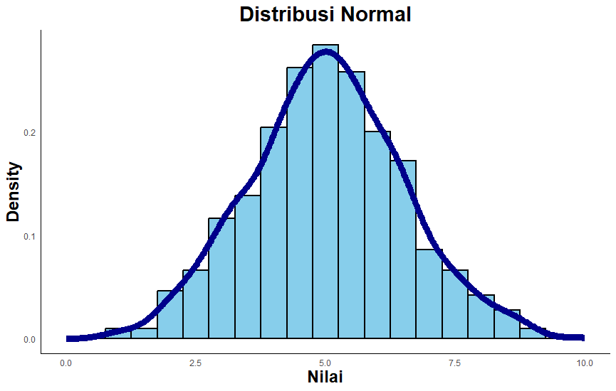
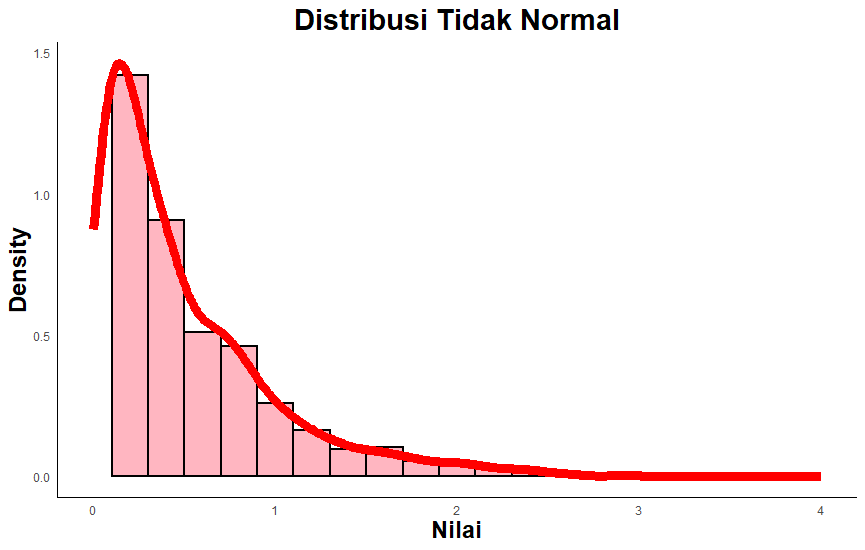

# Statistik Parametrik dan Non-Parametrik

Dalam statistik inferensial, metode analisis dapat dibedakan menjadi dua kelompok besar, yaitu statistik **parametrik** dan statistik **non-parametrik**. Pemilihan metode ini berpengaruh pada validitas hasil analisis karena masing-masing memiliki asumsi dan prinsip kerja yang berbeda. Meskipun keduanya bertujuan untuk menarik kesimpulan dari data sampel ke populasi, perbedaan pendekatan dapat memengaruhi akurasi dan kekuatan analisis.

## Asumsi Parametrik

Metode analisis parametrik bekerja dengan optimal jika data memiliki distribusi normal (lihat @sec-distribusi). Karena berbagai prosedur parametrik—seperti estimasi parameter dan pengujian hipotesis—mengandalkan sifat distribusi normal, penyimpangan yang besar dari normalitas dapat membuat hasil analisis menjadi bias atau kurang akurat. Oleh karena itu, sebelum menggunakan metode parametrik, peneliti perlu memeriksa apakah data mendekati distribusi normal melalui uji statistik maupun pemeriksaan visual.

Pemeriksaan melalui **metode visual** bisa dilihat berdasarkan kurva sebaran data. Salah satu yang paling umum digunakan adalah grafik histogram. Jika histogram tampak seperti lonceng, maka distribusi data tersebut dikatakan normal. Sebaliknya, jika terdapat kemiringan sehingga kurva terlihat jelas tidak simetris, maka data tidak terdistribusi dengan normal (lihat @fig-normal).

Metode **pengujian statsitik** dapat menjadi cara yang paling akurat untuk menentukan normalitas distribusi data [@Field2018; @Tabachnick2019]. Terdapat dua uji statistik yang cukup umum digunakan digunakan dalam konteks riset ilmu sosial, yaitu ***Kolmogorov-Smirnov*** (KS) dan ***Shapiro-Wilk*** (SW). Sejumlah studi mengungkapkan bahwa uji SW lebih andal dibanding KS karena memiliki daya uji (*power*) yang lebih tinggi dalam mendeteksi berbagai bentuk penyimpangan dari normalitas, baik akibat *skewness* maupun *kurtosis*, pada hampir semua ukuran sampel dan jenis distribusi [@Oktaviani2014; @Razali2011; @Yap2011]. Selain itu, KS cenderung kurang *powerful* untuk sampel kecil [@Ghasemi2012]. Oleh karena itu, tes SW lebih disarankan untuk digunakan dalam pengujian normalitas distribusi data.

::: {#fig-normal layout-ncol="2"}
{#fig-neg width="270"}

{#fig-pos width="270"}

Kurva distribusi data
:::

Data yang memenuhi asumsi parametrik dapat dianalisis lebih lanjut dengan statistik parametrik, sedangkan data yang tidak memenuhi asumsi dianalisis dengan menggunakan teknik statistik non-parametrik. Konsekuensi hasil analisisnya adalah pada generalisasi hasil analsis data. Pada statistik parameterik — karena data sampel terdistibusi normal — maka data tersebut dianggap mewakili populasi, sehingga setiap hasil analisis data tersebut dapat digenerasilasikan kepada populasinya. Dengan kata lain, hasil analisis data dianggap mencerminkan populasinya. Sedangkan jika data tidak memenuhi asumsi dan kemudian dianalisis dengan statistik non-parametrik, maka hasilnya tidak dapat disebut mencerminkan populasi, melainkan hanya menggambarkan sekelompok partisipan penelitian tersebut.

## Metode Parametrik

Metode **parametrik** adalah pendekatan analisis statistik yang mendasarkan perhitungannya pada **parameter populasi** yang diestimasi dari data sampel, seperti *mean*, varians, dan standar deviasi. Metode ini beroperasi di bawah asumsi bahwa data berasal dari populasi dengan distribusi tertentu, umumnya distribusi normal, sehingga sifat-sifat distribusi tersebut dapat digunakan untuk membangun **model matematis yang akurat**. Proses analisis dalam metode parametrik biasanya melibatkan penggunaan rumus yang memanfaatkan parameter-parameter ini untuk menghitung ukuran efek, menguji hipotesis, atau membuat estimasi terhadap populasi.

Kelebihan utama metode parametrik adalah **presisi** dan **kekuatan statistik yang tinggi**, artinya metode ini lebih mampu mendeteksi perbedaan atau hubungan yang benar-benar ada dalam data, asalkan asumsi normalitas terpenuhi. Hal ini karena informasi yang digunakan berasal dari seluruh nilai data, bukan hanya peringkat atau kategori. Akan tetapi, jika asumsi distribusi dilanggar—misalnya data tidak normal atau mengandung outlier ekstrem—maka metode parametrik bisa menghasilkan estimasi yang bias dan kesimpulan yang menyesatkan. Oleh sebab itu, pengujian asumsi, khususnya normalitas, menjadi langkah krusial sebelum memilih metode ini.

## Metode Non-Parametrik

Metode **non-parametrik** adalah pendekatan analisis statistik yang **tidak bergantung pada asumsi** bentuk distribusi tertentu dan tidak secara langsung menggunakan parameter populasi seperti *mean* atau varians dalam perhitungannya [@Conover1999]. Metode ini sering digunakan ketika data tidak memenuhi asumsi normalitas atau ketika data yang dimiliki berskala ordinal dan nominal, di mana informasi yang tersedia hanya berupa urutan atau kategori. Dalam praktiknya, metode non-parametrik banyak mengandalkan **peringkat** (*ranking*) untuk melakukan perbandingan antar kelompok atau mengukur hubungan antar variabel.

Kelebihan metode non-parametrik terletak pada **fleksibilitasnya** terhadap bentuk data —metode ini tetap dapat digunakan meskipun data terdistribusi miring, memiliki *outlier*, atau jumlah sampel relatif kecil. Selain itu, metode ini lebih “aman” digunakan jika peneliti tidak yakin bahwa asumsi parametrik terpenuhi. Namun, konsekuensi dari fleksibilitas ini adalah **kekuatan statistik yang umumnya lebih rendah** dibandingkan metode parametrik ketika asumsi normalitas sebenarnya terpenuhi. Artinya, metode non-parametrik mungkin **kurang sensitif** dalam mendeteksi perbedaan atau hubungan yang ada, sehingga hasil yang signifikan memerlukan efek yang lebih besar atau jumlah sampel yang lebih banyak.

Rangkuman perbandingan secara umum antara kedua metode analisis (parametrik vs. non-parametrik) dapat dilihat di @tbl-parametrik.

::: {#tbl-parametrik}
| Aspek | Statistik Parametrik | Statistik Non-parametrik |
|----|----|----|
| Asumsi utama | Data berasal dari populasi yang berdistribusi normal. | Tidak memerlukan asumsi distribusi normal |
| Jenis data yang cocok | Data berskala interval atau rasio | Data berskala ordinal atau nominal, atau data interval/rasio yang tidak normal |
| Kelebihan | Memiliki daya statistik lebih tinggi jika asumsi normalitas terpenuhi | Lebih fleksibel terhadap pelanggaran asumsi dan dapat digunakan pada data yang tidak normal |
| Kekurangan | Data harus memenuhi asumsi-asumsi yang ketat | Umumnya memiliki kekuatan statistik lebih rendah |
| Konsekuensi praktis | Memberikan hasil yang lebih presisi pada data yang memenuhi asumsi normalitas | Memberikan hasil yang kurang sensitif dalam mendeteksi perbedaan atau hubungan yang ada |

: Perbandingan metode statistik parametrik dan non-parametrik
:::

:::: {.content-visible when-format="html"}
::: callout-tip
## Simulasi Interaktif

```{=html}
<div class="stats-card">
  <h2>🧪 Uji Normalitas Data (Shapiro–Wilk)</h2>
  <p class="desc">Generate data acak, hitung nilai W dan p-value, lalu tebak distribusinya.</p>

  <div style="display:flex; gap:8px; flex-wrap:wrap; margin-bottom:8px;">
    <button id="genBtn" class="btn primary" style="flex:1;">🎲 Generate Data</button>
    <button id="resetBtn" class="btn danger small">♻️ Reset</button>
  </div>

  <textarea id="dataBox" rows="5" placeholder="Data akan muncul di sini..." readonly></textarea>
  
  <button id="calcBtn" class="btn secondary" style="width:100%;" disabled>📊 Hitung Shapiro–Wilk</button>

  <div id="resultSection" style="margin-top:12px; display:none;">
    <p><strong>Hasil Uji Shapiro–Wilk:</strong></p>
    <p>W = <span id="wValue"></span></p>
    <p>p-value = <span id="pValue"></span></p>
  </div>

  <div id="quizSection" style="margin-top:15px; display:none;">
    <p><strong>Pertanyaan:</strong> Berdasarkan p-value di atas, bagaimana distribusi data?</p>
    <div style="display:flex; gap:8px; flex-wrap:wrap;">
      <button class="btn quiz-btn" data-ans="normal">Normal</button>
      <button class="btn quiz-btn" data-ans="tidak">Tidak Normal</button>
    </div>
    <div id="quizFeedback" style="margin-top:10px; font-size:1.2rem;"></div>
    <!-- Tombol Reset tambahan di bawah -->
    <button id="resetBtnBottom" class="btn danger" style="width:100%; margin-top:15px;">♻️ Reset All</button>
  </div>
</div>

<style>
  .stats-card {
    max-width: 520px;
    background: #fff;
    padding: 20px;
    border-radius: 14px;
    box-shadow: 0 4px 18px rgba(0,0,0,0.08);
    font-family: system-ui, sans-serif;
    color: #222;
    margin: 12px auto;
  }
  .stats-card h2 {
    font-size: 2.2rem;
    margin-top: 0;
    color: #4a3aff;
  }
  .stats-card .desc {
    font-size: 1.5rem;
    margin-bottom: 12px;
    color: #555;
  }
  .stats-card textarea {
    width: 100%;
    font-size: 1.4rem;
    font-family: monospace;
    padding: 10px;
    border-radius: 10px;
    border: 1px solid #ccc;
    background: #f0f0f0;
    resize: vertical;
    margin-bottom: 8px;
  }
  .btn {
    padding: 12px;
    font-size: 1.2rem;
    font-weight: 600;
    border: none;
    border-radius: 10px;
    cursor: pointer;
    transition: opacity 0.2s;
  }
  .btn:disabled {
    opacity: 0.6;
    cursor: not-allowed;
  }
  .btn.primary { background: linear-gradient(135deg, #4a3aff, #6c63ff); color: #fff; }
  .btn.secondary { background: linear-gradient(135deg, #009688, #4db6ac); color: #fff; }
  .btn.danger { background: linear-gradient(135deg, #e53935, #ef5350); color: #fff; }
  .btn.small { padding: 8px 14px; font-size: 1rem; }
</style>

<script>
document.addEventListener("DOMContentLoaded", () => {
  // ---- Fungsi utilitas ----
  function mean(arr) { return arr.reduce((a,b)=>a+b,0)/arr.length; }
  function stddev(arr) { 
    let m = mean(arr); 
    return Math.sqrt(arr.reduce((sum,v)=>sum+(v-m)**2,0)/(arr.length-1)); 
  }

  // ---- Fungsi dasar distribusi normal ----
  function randNormalRaw(mean=50, sd=10){
    let u=0, v=0;
    while(u===0) u = Math.random();
    while(v===0) v = Math.random();
    let num = Math.sqrt(-2.0*Math.log(u)) * Math.cos(2.0*Math.PI*v);
    return mean + sd * num;
  }
  function randNormalInt(mean=50, sd=10){ return Math.round(randNormalRaw(mean, sd)); }
  function randSkewedPositiveInt(mean=50, sd=10){ return Math.round(mean + Math.abs(randNormalRaw(0, sd))); }
  function randSkewedNegativeInt(mean=50, sd=10){ return Math.round(mean - Math.abs(randNormalRaw(0, sd))); }

  // ---- Approx Shapiro–Wilk ----
  function shapiroWilkTest(x) {
    let n = x.length;
    let sorted = [...x].sort((a,b)=>a-b);
    let m = mean(sorted);
    let s = stddev(sorted);
    
    let a = [];
    for (let i=0; i<n; i++) {
      let val = (i+1 - 0.375) / (n + 0.25);
      a.push(normSInv(val));
    }
    let c = Math.sqrt(a.reduce((sum,v)=>sum+v*v,0));
    a = a.map(v => v/c);

    let b = 0;
    for (let i=0; i<n/2; i++) {
      b += a[i] * (sorted[n-1-i] - sorted[i]);
    }
    let W = (b*b) / (x.reduce((sum,v)=>sum+(v-m)**2,0));
    let p = Math.max(0, Math.min(1, 1 - Math.exp(-5*(W-0.9)))); 
    return {W, p};
  }

  // ---- Inverse Normal CDF ----
  function normSInv(p) {
    if (p <= 0 || p >= 1) return 0;
    const a1=-39.6968302866538,a2=220.946098424521,a3=-275.928510446969;
    const a4=138.357751867269,a5=-30.6647980661472,a6=2.50662827745924;
    const b1=-54.4760987982241,b2=161.585836858041,b3=-155.698979859887;
    const b4=66.8013118877197,b5=-13.2806815528857;
    const c1=-0.00778489400243029,c2=-0.322396458041136,c3=-2.40075827716184;
    const c4=-2.54973253934373,c5=4.37466414146497,c6=2.93816398269878;
    const d1=0.00778469570904146,d2=0.32246712907004,d3=2.445134137143,d4=3.75440866190742;
    const plow=0.02425, phigh=1-plow;
    let q,r;
    if (p < plow) { q=Math.sqrt(-2*Math.log(p)); return (((((c1*q+c2)*q+c3)*q+c4)*q+c5)*q+c6)/((((d1*q+d2)*q+d3)*q+d4)*q+1);}
    if (phigh < p){ q=Math.sqrt(-2*Math.log(1-p)); return -(((((c1*q+c2)*q+c3)*q+c4)*q+c5)*q+c6)/((((d1*q+d2)*q+d3)*q+d4)*q+1);}
    q=p-0.5;r=q*q;
    return (((((a1*r+a2)*r+a3)*r+a4)*r+a5)*r+a6)*q/(((((b1*r+b2)*r+b3)*r+b4)*r+b5)*r+1);
  }

  // ---- Event handling ----
  const $ = id => document.getElementById(id);
  let currentData = [];
  let currentType = "";

  // Fungsi untuk update status tombol hitung
  function updateCalcBtnState() {
    $('calcBtn').disabled = currentData.length === 0;
  }

  $('genBtn').addEventListener('click', ()=>{
    let type = Math.random() < 0.5 ? "normal" : "tidak";
    if (type === "normal") {
      currentData = Array.from({length:40}, ()=>randNormalInt(50,10));
    } else {
      if (Math.random() < 0.5) {
        currentData = Array.from({length:40}, ()=>randSkewedPositiveInt(40,10));
      } else {
        currentData = Array.from({length:40}, ()=>randSkewedNegativeInt(60,10));
      }
    }
    currentType = type;
    $('dataBox').value = currentData.join(", ");
    $('resultSection').style.display = "none";
    $('quizSection').style.display = "none";
    $('quizFeedback').innerHTML = "";
    document.querySelectorAll('.quiz-btn').forEach(b=>{ 
      b.style.background=""; 
      b.style.color=""; 
      b.disabled=false; 
    });
    updateCalcBtnState(); // Update status tombol hitung
  });

  $('calcBtn').addEventListener('click', ()=>{
    if(currentData.length===0) return; // Tambahan pengaman
    let res = shapiroWilkTest(currentData);
    $('wValue').textContent = res.W.toFixed(4);
    $('pValue').textContent = res.p.toFixed(4);
    $('resultSection').style.display = "block";
    $('quizSection').style.display = "block";
  });

  document.querySelectorAll('.quiz-btn').forEach(btn => {
    btn.addEventListener('click', () => {
      let ans = btn.dataset.ans;
      document.querySelectorAll('.quiz-btn').forEach(b => b.disabled = true);
      
      const pValue = parseFloat($('pValue').textContent);
      const isNormal = pValue > 0.05;
      const correctAns = isNormal ? "normal" : "tidak";
      
      if (ans === correctAns) {
        btn.style.background = 'green';
        btn.style.color = 'white';
        $('quizFeedback').innerHTML = "<strong style='color:green;'>Tepat!</strong>";
      } else {
        btn.style.background = 'red';
        btn.style.color = 'white';
        
        document.querySelectorAll('.quiz-btn').forEach(b => {
          if (b.dataset.ans === correctAns) {
            b.style.background = 'green';
            b.style.color = 'white';
          }
        });
        
        const alasan = isNormal
          ? "Karena p-value > 0.05, data dianggap normal."
          : "Karena p-value ≤ 0.05, data dianggap tidak normal.";
        
        $('quizFeedback').innerHTML = `
          <strong style='color:red;'>Salah</strong>. 
          Jawaban benar: <strong>${isNormal ? "Normal" : "Tidak Normal"}</strong>. 
          ${alasan}
        `;
      }
    });
  });

  // Fungsi reset
  function resetAll() {
    currentData = [];
    $('dataBox').value = "";
    $('resultSection').style.display = "none";
    $('quizSection').style.display = "none";
    $('quizFeedback').innerHTML = "";
    document.querySelectorAll('.quiz-btn').forEach(b=>{
      b.disabled=false; 
      b.style.background=""; 
      b.style.color="";
    });
    updateCalcBtnState(); // Update status tombol hitung
  }

  // Event listener untuk kedua tombol reset
  $('resetBtn').addEventListener('click', resetAll);
  $('resetBtnBottom').addEventListener('click', resetAll);

  // Inisialisasi awal
  updateCalcBtnState();
});
</script>
```
:::
::::

:::: {.content-visible when-format="pdf"}
::: callout-tip
## Simulasi Interaktif

### Simulasi Uji Normalitas Data {.unnumbered}

\qrcode[height=3.0cm]{https://bit.ly/4peNtHD}

\vspace{1cm}

\small\textit{Scan QR atau klik \href{https://bit.ly/4peNtHD}{link ini} untuk membuka simulasi interaktif.}
:::
::::
