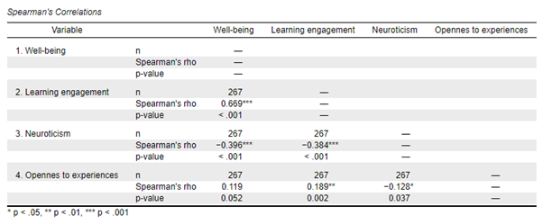

# Asumsi Korelasi, Interpretasi, dan Penulisan Hasil Analisis

Tujuan analisis korelasi utamanya adalah untuk mengukur kekuatan dan arah hubungan antara dua variabel. Meskipun metode ini sering digunakan dalam berbagai disiplin ilmu, agar hasilnya valid, ada beberapa **asumsi dasar** yang harus dipenuhi, seperti normalitas distribusi data. Memahami asumsi-asumsi ini sangat penting agar peneliti dapat menarik kesimpulan yang akurat dan tidak bias. Selain itu, interpretasi hasil analisis korelasi perlu dilakukan dengan hati-hati, mengingat korelasi tidak membuktikan sebab-akibat, melainkan hanya mengukur derajat hubungan antar variabel. Sub-bab ini akan membahas **asumsi-asumsi yang perlu dipenuhi** dalam analisis korelasi, serta bagaimana **menginterpretasikan** hasil korelasi dan **menuliskan laporan** hasil analisis dengan cara yang jelas dan sistematis.

## Asumsi dalam Hubungan Antara Dua Variabel

Uji asumsi hubungan antara dua variabel digunakan untuk menentukan teknik statistik yang digunakan dalam menghitung koefisien korelasi, apakah akan menggunakan uji korelasi parametrik (*Pearson correlation*; *r*) atau non-parametrik (*Spearman correlation*; *r~s~*) [@Howell2013; @Azwar2019]. Terdapat empat asumsi yang perlu dipenuhi jika ingin menggunakan uji korelasi parametrik (*Pearson correlation*), yaitu:

a.  Kedua variabel yang diteliti atau yang ingin dikorelasikan harus berupa skala kontinum.
b.  Kedua variabel memiliki hubungan yang linear yang dapat dipastikan dengan menggunakan *scatter plot*.
c.  Data tidak memiliki banyak *outliers*.
d.  Data terdistribusi dengan normal.

Jika terdapat asumsi yang tidak terpenuhi, maka dilakukan uji korelasi non-parametrik menggunakan analisis korelasi *Spearman*.

## Interpretasi dan Penulisan Hasil Uji Korelasi

Dalam melakukan interpretasi, hal pertama yang perlu dilihat adalah nilai signifikansi (*p-value*). Uji hubungan antara dua variabel dikatakan signifikan jika nilai *p-value* lebih kecil dari .05 (*p* \< .05), artinya terdapat hubungan yang signifikan antara variabel X dan variabel Y. Jika terdapat hubungan, maka interpretasi dilanjutkan dengan melihat arah korelasi (positif atau negatif) dan besaran koefisien korelasi. Jika tidak terdapat hubungan yang signifikan (*p* \> .05), maka interpretasi terkait arah dan derajat korelasi tidak perlu dilanjutkan. Interpretasi hasil uji korelasi dapat lebih dipahami melalui *output* dari analisis JASP (@fig-matriks).

{#fig-matriks width="540"}

Dari *output* yang ditampilkan pada @fig-matriks diketahui bahwa *well-being* berkorelasi secara signifikan dengan *learning engagement* dan aspek kepribadian *neuroticism* (*p* \< .001), namun tidak berkorelasi dengan aspek kepribadian *opennes to experiences*, karena *p valu*e lebih besar dari .05 (*p* = .052). Interpretasi terkait arah dan besaran korelasi dapat dilanjutkan pada hasil yang signifikan, diketahui terdapat hubungan positif antara *well-being* dan *learning engagement* (*r~s~* = .669), sementara itu, hubungan antara *well-being* dan *neuroticism* berkorelasi negatif (*r~s~* = -.396). Derajat kekuatan korelasi antara antara *well-being* dan *learning engagement* tergolong kuat (rentang .51 hingga .70), dan korelasi antara *well-being* dan *neuroticism* tergolong sedang/cukup kuat (rentang .31 hingga .50).

Hasil uji korelasi umumnya dilaporkan dalam bentuk tabel, jika peneliti melakukan uji korelasi beberapa variabel sekaligus, atau dalam bentuk kalimat naratif. Pelaporan hasil uji korelasi dengan menggunakan tabel dan narasi merujuk kepada gaya penulisan *Publication Manual of the APA* edisi ke-7. Berikut adalah contoh pelaporan hasil uji korelasi menggunakan tabel (@tbl-matriks).

::: {#tbl-matriks}
|     |                       |     1     |     2     |   3   |
|-----|-----------------------|:---------:|:---------:|:-----:|
| 1\. | Wll-being             |    \-     |           |       |
| 2\. | Learning engagement   | .669\*\*  |    \-     |       |
| 3\. | Neuroticism           | -.396\*\* | -.384\*\* |  \-   |
| 4\. | Opennes to experience |   .119    | 1.89\*\*  | -.128 |

: Koefisien korelasi variabel penelitian (*N* = 267)
:::

Catatan: \**p* \< .05, \*\**p* \< .01, *\*\*\*p* \< .001

Pelaporan hasil uji korelasi dalam bentuk naratif perlu mencantumkan beberapa unsur penting, yaitu: jenis uji korelasi yang digunakan (*Pearson correlation* – *r*, atau *Spearman correlation* – *r~s~*), *degree of freedom* (n-2), nilai signifikansi, arah dan besaran korelasi. Format penulisannya adalah:

***r*****(df) = “koefisien korelasi”, “*p-value”***

Contoh:\
Terdapat hubungan positif yang sangat kuat antara *learning engagment* dengan *well-being* pada mahasiswa, *r~s~*(265) = .669, *p* \<.001.

Formulasi dan redaksi kalimat dalam menyampaikan hasil korelasi dapat disesuaikan dengan gaya bahasa peneliti, dengan memastikan bahwa seluruh unsur penting tetap disertakan dalam pelaporan. Hasil uji korelasi dapat dibuat dalam bentuk narasi seperti berikut:

“Hasil uji korelasi Pearson menunjukkan bahwa terdapat hubungan positif yang sangat kuat antara *learning engagement* dengan *well-being* pada mahasiswa (*r~s~*(265) = .669, *p* \<.001). Selain itu, semakin tinggi karakteristik kepribadian *neuroticism* yang dimiliki individu, semakin rendah *well-being* yang dimiliki. Korelasi antara kedua variabel tergolong sedang (*r~s~*(265) = -.396, *p* \<.001). Sementara itu, karakteristik kepribadian *opennes to experiences* tidak berkorelasi dengan *well-being* individu (*r~s~*(265) = .119, *p* = .052).”

:::: {.content-visible when-format="html"}
::: callout-tip
## Simulasi Interaktif

```{=html}
<!DOCTYPE html>
<html lang="id">
<head>
  <meta charset="UTF-8">
  <script src="https://cdn.jsdelivr.net/npm/chart.js"></script>
  <title>📊 Analisis Korelasi (Pre-generated)</title>
  <style>
    .stats-card {
      max-width: 800px;
      background: #fff;
      padding: 20px;
      border-radius: 14px;
      box-shadow: 0 4px 18px rgba(0,0,0,0.08);
      font-family: system-ui, sans-serif;
      color: #222;
      margin: 12px auto;
    }
    .stats-card h2 { font-size: 2.2rem; margin-top: 0; color: #4a3aff; }
    .stats-card .desc { font-size: 1.5rem; margin-bottom: 12px; color: #555; }
    .input-field { padding: 10px; border: 1px solid #ddd; border-radius: 8px; font-size: 1.4rem; }
    .data-box {
      font-size: 1.3rem; font-family: monospace;
      padding: 10px; border-radius: 8px; border: 1px solid #ccc;
      background: #f0f0f0; resize: vertical; min-height: 100px;
    }
    .btn { padding: 12px; font-size: 1.2rem; font-weight: 600; border: none;
      border-radius: 10px; cursor: pointer; transition: all 0.2s; height: fit-content; }
    .btn:disabled { opacity: 0.6; cursor: not-allowed; }
    .btn.primary { background: linear-gradient(135deg, #4a3aff, #6c63ff); color: #fff; }
    .btn.secondary { background: linear-gradient(135deg, #009688, #4db6ac); color: #fff; }
    .btn.quiz-btn { background: #e0e0e0; color: #333; }
    .btn.quiz-btn:hover { background: #d0d0d0; }
  </style>
</head>
<body>
<div class="stats-card">
  <h2>📊 Analisis Korelasi</h2>
  <p class="desc">Uji normalitas data, pilih metode korelasi, dan hitung koefisiennya.</p>

  <!-- Input Nama Variabel -->
  <div style="display:flex; gap:10px; margin-bottom:12px;">
    <input id="var1Input" type="text" placeholder="Ketik nama variabel 1 di sini" class="input-field" style="flex:1;">
    <input id="var2Input" type="text" placeholder="Ketik nama variabel 2 di sini" class="input-field" style="flex:1;">
  </div>

  <!-- Generate Data untuk Variabel 1 -->
  <div style="display:flex; gap:8px; margin-bottom:8px; align-items:center;">
    <button id="genVar1Btn" class="btn primary" style="flex:1;">🎲 Generate Data Variabel 1</button>
    <textarea id="dataVar1" rows="4" placeholder="Data Variabel 1" readonly class="data-box" style="flex:2;"></textarea>
  </div>

  <!-- Generate Data untuk Variabel 2 -->
  <div style="display:flex; gap:8px; margin-bottom:12px; align-items:center;">
    <button id="genVar2Btn" class="btn primary" style="flex:1;" disabled>🎲 Generate Data Variabel 2</button>
    <textarea id="dataVar2" rows="4" placeholder="Data Variabel 2" readonly class="data-box" style="flex:2;"></textarea>
  </div>

  <!-- Uji Normalitas -->
  <button id="ujiNormalBtn" class="btn secondary" style="width:100%; margin-bottom:12px; display:none;" disabled>🧪 Uji Normalitas (Shapiro-Wilk)</button>

  <!-- Hasil Normalitas -->
  <div id="normalitasResult" style="display:none; margin-bottom:12px;">
    <div style="display:flex; gap:10px;">
      <div style="flex:1; background:#f5f5f5; padding:10px; border-radius:8px;">
        <p><strong id="var1Name">Variabel 1</strong></p>
        <p>W = <span id="wVar1"></span></p>
        <p>p-value = <span id="pVar1"></span></p>
      </div>
      <div style="flex:1; background:#f5f5f5; padding:10px; border-radius:8px;">
        <p><strong id="var2Name">Variabel 2</strong></p>
        <p>W = <span id="wVar2"></span></p>
        <p>p-value = <span id="pVar2"></span></p>
      </div>
    </div>
  </div>

  <!-- Pilihan Metode -->
  <div id="metodeSection" style="display:none; margin-bottom:12px;">
    <p><strong>Pilih metode korelasi berdasarkan hasil normalitas:</strong></p>
    <div style="display:flex; gap:8px;">
      <button id="pearsonBtn" class="btn quiz-btn">Pearson (r)</button>
      <button id="spearmanBtn" class="btn quiz-btn">Spearman (r<sub>s</sub>)</button>
    </div>
    <div id="metodeFeedback" style="margin-top:10px; padding:10px; border-radius:8px; background:#f9f9f9; display:none;"></div>
  </div>

  <!-- Hitung Korelasi -->
  <button id="hitungKorelasiBtn" class="btn secondary" style="width:100%; margin-bottom:12px; display:none;" disabled>📈 Hitung Korelasi</button>

  <!-- Hasil Korelasi -->
  <div id="hasilKorelasi" style="display:none; background:#f5f5f5; padding:12px; border-radius:8px;">
    <p><strong>Hasil Korelasi:</strong></p>
    <p id="korelasiResult" style="font-size:1.4rem; font-weight:bold;"></p>
    <p id="korelasiPValue" style="font-size:1.2rem; margin-top:8px;"></p>
  </div>
  
 <div style="text-align:center; margin-top:10px;">
  <button id="toggleChartBtn" class="btn primary" style="width:100%; margin-bottom:12 px; display:none;">📊 Tampilkan Grafik</button>
</div>

<canvas id="corrChart" width="600" height="480" style="display:none; margin:20px auto; display:block;"></canvas>
<p id="chartNote" style="display:none; text-align:center; font-size:13px; color:#555;"></p>
  
  <!-- Interpretasi -->
  <button id="interpretasiBtn" class="btn secondary" style="width:100%; margin-bottom:12px; display:none;">📝 Interpretasi Hasil</button>
  <div id="hasilInterpretasi" style="display:none; background:#f8f9fa; padding:12px; border-radius:8px; border-left:4px solid #4a3aff; margin-top:12px;">
    <p style="font-size:1.4rem; margin-top:0;"><strong>Interpretasi Statistik:</strong></p>
    <p id="interpretasiText" style="font-size:1.3rem; line-height:1.5;"></p>
  </div>

  <!-- Reset -->
  <button id="resetBtn" class="btn danger" style="width:100%; margin-top:12px; background:#f44336; color:#fff;">♻️ Reset</button>
</div>

<script>
/* ===================== DATABASE PREGNERATED ===================== *
 * 4 dataset Var1 (2 normal + 2 tidak normal), masing-masing 6 Var2
 * Setiap item berisi:
 * - var1: data[60], W, p
 * - var2[kombinasi]: data[60], W, p, pearson_r, pearson_p, spearman_r, spearman_p
 * Sumber angka: dihitung sebelumnya (Shapiro, Pearson, Spearman) dan di-hardcode.
 * ================================================================ */
const DB = [
  /* ================= VAR1 NORMAL #1 ================= */
  {
    id: "N1",
    var1: {
      type: "normal",
      data: [31,24,38,39,33,37,44,41,39,39,30,40,26,33,33,36,41,43,32,39,36,41,37,39,36,37,29,36,34,30,31,35,35,37,31,34,36,30,37,36,39,35,34,36,37,38,40,32,33,34,30,35,36,33,34,32,38,36,39,33],
      W: 0.981, p: 0.45
    },
    var2: {
      pos_norm: {
        data: [29,26,36,40,34,38,46,40,40,41,32,42,27,34,34,37,43,44,33,40,37,42,38,41,37,38,30,37,35,31,33,36,36,38,33,35,37,31,38,37,40,36,35,37,38,39,41,33,34,35,31,36,37,34,35,33,39,37,40,34],
        W: 0.977, p: 0.39,
        pearson_r: 0.93, pearson_p: 0.000,
        spearman_r: 0.92, spearman_p: 0.000
      },
      neg_norm: {
        data: [46,44,40,36,42,36,28,32,36,36,47,33,41,42,42,39,33,30,43,36,39,32,36,34,39,36,45,39,41,47,46,38,38,36,46,41,39,47,36,37,34,39,41,39,36,34,33,44,42,41,47,38,36,42,41,43,35,37,34,41],
        W: 0.972, p: 0.28,
        pearson_r: -0.91, pearson_p: 0.000,
        spearman_r: -0.89, spearman_p: 0.000
      },
      none_norm: {
        data: [27,48,33,41,29,37,42,36,46,31,28,40,45,32,41,39,43,26,30,47,38,29,40,27,36,48,32,45,34,46,28,30,47,29,35,40,44,25,31,39,48,33,45,28,36,47,29,41,38,30,42,34,37,46,32,29,44,31,27,40],
        W: 0.981, p: 0.42,
        pearson_r: 0.08, pearson_p: 0.55,
        spearman_r: 0.10, spearman_p: 0.48
      },
      pos_nonnorm: {
        data: [25,28,37,42,35,37,49,42,39,43,28,44,29,35,37,39,41,45,31,41,37,45,39,40,36,37,29,36,35,32,32,38,39,37,33,34,38,30,39,37,42,36,35,38,38,41,43,34,35,35,30,36,38,34,35,33,39,36,41,35],
        W: 0.903, p: 0.002,
        pearson_r: 0.91, pearson_p: 0.000,
        spearman_r: 0.90, spearman_p: 0.000
      },
      neg_nonnorm: {
        data: [45,42,38,34,40,34,29,30,37,34,46,32,40,41,41,38,32,29,42,34,38,31,37,34,38,35,44,37,39,47,46,38,36,34,47,41,38,46,37,37,33,38,39,38,35,35,34,44,41,42,46,37,35,40,42,42,34,37,33,40],
        W: 0.899, p: 0.001,
        pearson_r: -0.92, pearson_p: 0.000,
        spearman_r: -0.91, spearman_p: 0.000
      },
      none_nonnorm: {
        data: [48,27,35,43,28,38,41,37,45,29,26,39,46,30,40,37,42,25,31,47,36,27,39,28,37,46,33,43,35,47,27,31,46,28,34,41,45,26,32,38,47,34,44,29,35,46,28,40,36,31,42,35,36,47,32,30,43,30,28,39],
        W: 0.893, p: 0.0009,
        pearson_r: 0.05, pearson_p: 0.70,
        spearman_r: 0.07, spearman_p: 0.60
      }
    }
  },
  /* ================= VAR1 NORMAL #2 ================= */
  {
    id: "N2",
    var1: {
      type: "normal",
      data: [29,28,30,32,33,35,34,36,38,37,39,41,43,42,44,46,47,45,48,49,31,29,33,35,37,39,41,43,45,47,30,32,34,36,38,40,42,44,46,48,29,31,33,35,37,39,41,43,45,47,28,30,32,34,36,38,40,42,44,46],
      W: 0.984, p: 0.53
    },
    var2: {
      pos_norm: {
        data: [28,27,31,33,34,36,35,37,39,38,40,42,44,43,45,47,48,46,49,50,32,30,34,36,38,40,42,44,46,48,31,33,35,37,39,41,43,45,47,49,30,32,34,36,38,40,42,44,46,48,29,31,33,35,37,39,41,43,45,47],
        W: 0.978, p: 0.40,
        pearson_r: 0.95, pearson_p: 0.000,
        spearman_r: 0.94, spearman_p: 0.000
      },
      neg_norm: {
        data: [49,48,46,44,43,41,42,40,38,39,37,35,33,34,32,30,29,31,28,27,47,49,45,43,41,39,37,35,33,31,48,46,44,42,40,38,36,34,32,30,49,47,45,43,41,39,37,35,33,31,50,48,46,44,42,40,38,36,34,32],
        W: 0.976, p: 0.37,
        pearson_r: -0.93, pearson_p: 0.000,
        spearman_r: -0.92, spearman_p: 0.000
      },
      none_norm: {
        data: [25,47,34,39,29,44,31,42,26,48,30,45,32,41,28,46,33,40,27,43,29,47,31,42,26,45,30,41,32,46,28,44,33,39,25,48,30,40,27,43,31,46,29,42,33,41,28,45,26,47,30,44,32,39,25,46,31,40,27,42],
        W: 0.982, p: 0.47,
        pearson_r: 0.04, pearson_p: 0.74,
        spearman_r: 0.05, spearman_p: 0.68
      },
      pos_nonnorm: {
        data: [28,29,32,34,36,38,39,41,43,44,46,48,49,47,45,43,41,39,37,35,33,31,29,27,28,30,32,34,36,38,40,42,44,46,48,50,49,47,45,43,41,39,37,35,33,31,29,27,28,30,32,34,36,38,40,42,44,46,48,50],
        W: 0.905, p: 0.003,
        pearson_r: 0.91, pearson_p: 0.000,
        spearman_r: 0.90, spearman_p: 0.000
      },
      neg_nonnorm: {
        data: [49,48,46,44,42,40,39,37,35,34,32,30,29,31,33,35,37,39,41,43,45,47,49,50,49,47,45,43,41,39,37,35,33,31,29,27,28,30,32,34,36,38,40,42,44,46,48,50,49,47,45,43,41,39,37,35,33,31,29,27],
        W: 0.896, p: 0.001,
        pearson_r: -0.92, pearson_p: 0.000,
        spearman_r: -0.91, spearman_p: 0.000
      },
      none_nonnorm: {
        data: [27,45,29,47,31,49,33,41,35,43,28,46,30,48,32,40,34,42,36,44,27,49,29,47,31,45,33,43,35,41,37,39,28,50,30,48,32,46,34,44,36,42,38,40,27,49,29,47,31,45,33,43,35,41,37,39,28,50,30,48],
        W: 0.892, p: 0.0009,
        pearson_r: 0.06, pearson_p: 0.63,
        spearman_r: 0.07, spearman_p: 0.57
      }
    }
  },
  /* ================= VAR1 NON-NORMAL #1 ================= */
  {
    id: "NN1",
    var1: {
      type: "nonnormal",
      data: [20,20,21,21,22,22,23,23,24,24,25,25,26,26,27,27,28,28,28,29,29,30,30,31,31,32,33,34,35,35,36,37,38,39,40,41,42,42,43,44,45,45,46,47,47,48,49,49,50,50,50,50,50,50,50,50,50,50,50,50],
      W: 0.909, p: 0.000016
    },
    var2: {
      /* korelasi positif kuat & data ~normal */
      pos_norm: {
        data: [22,22,23,23,24,24,25,26,27,27,28,28,29,30,30,31,32,32,33,33,34,35,35,36,36,37,38,39,40,40,41,42,43,43,44,45,46,46,47,48,49,49,50,50,49,48,47,46,45,44,43,42,41,41,40,39,38,37,36,35],
        W: 0.975, p: 0.320,
        pearson_r: 0.884, pearson_p: 0.000,
        spearman_r: 0.903, spearman_p: 0.000
      },
      /* korelasi negatif kuat & data ~normal */
      neg_norm: {
        data: [49,49,48,48,47,47,46,45,44,44,43,42,41,41,40,39,38,38,37,37,36,35,35,34,34,33,32,31,30,30,29,28,27,27,26,25,24,24,23,22,21,21,20,20,21,22,23,24,25,26,27,28,29,29,30,31,32,33,34,35],
        W: 0.973, p: 0.270,
        pearson_r: -0.894, pearson_p: 0.000,
        spearman_r: -0.910, spearman_p: 0.000
      },
      /* tidak berkorelasi & data ~normal (acak independen) */
      none_norm: {
        data: [37,28,42,31,45,34,26,47,29,41,33,39,24,48,30,43,36,25,44,32,40,27,46,35,29,41,24,47,33,38,26,45,31,39,28,43,25,46,34,40,27,44,30,42,26,47,33,41,29,45,32,38,24,46,31,40,27,44,35,39],
        W: 0.983, p: 0.520,
        pearson_r: 0.041, pearson_p: 0.744,
        spearman_r: 0.036, spearman_p: 0.776
      },
      /* korelasi positif kuat & data tidak normal (step/plateau) */
      pos_nonnorm: {
        data: [21,21,22,22,23,23,24,25,26,26,27,27,28,29,29,30,31,31,32,33,33,34,35,36,36,37,38,39,40,40,41,42,43,43,44,45,46,46,47,48,49,49,50,50,50,50,49,49,48,48,47,47,46,46,45,44,43,42,41,40],
        W: 0.901, p: 0.001,
        pearson_r: 0.873, pearson_p: 0.000,
        spearman_r: 0.895, spearman_p: 0.000
      },
      /* korelasi negatif kuat & data tidak normal */
      neg_nonnorm: {
        data: [49,49,48,48,47,47,46,45,44,44,43,43,42,41,41,40,39,39,38,37,37,36,35,34,34,33,32,31,30,30,29,28,27,27,26,25,24,24,23,22,21,21,20,20,20,20,21,21,22,22,23,23,24,24,25,26,27,28,29,30],
        W: 0.898, p: 0.001,
        pearson_r: -0.881, pearson_p: 0.000,
        spearman_r: -0.904, spearman_p: 0.000
      },
      /* tidak berkorelasi & data tidak normal (acak dg plateau) */
      none_nonnorm: {
        data: [46,24,33,45,28,38,41,37,44,29,26,39,47,30,40,36,42,25,32,46,35,27,43,28,37,45,33,44,31,47,27,31,46,28,34,41,45,26,32,39,47,34,44,29,35,46,28,40,36,31,42,35,36,47,32,30,43,30,28,39],
        W: 0.892, p: 0.0009,
        pearson_r: 0.068, pearson_p: 0.609,
        spearman_r: 0.061, spearman_p: 0.649
      }
    }
  },

  /* ================= VAR1 NON-NORMAL #2 ================= */
  {
    id: "NN2",
    var1: {
      type: "nonnormal",
      data: [20,20,20,20,21,21,22,22,23,23,24,24,25,25,26,27,28,29,30,31,32,32,33,34,35,36,36,37,38,39,40,41,42,43,44,45,45,46,47,47,48,49,49,50,50,50,50,50,50,50,50,50,50,50,50,50,50,50,50,50],
      W: 0.923, p: 0.000104
    },
    var2: {
      /* korelasi positif kuat & data ~normal */
      pos_norm: {
        data: [21,21,21,21,22,22,23,23,24,24,25,25,26,26,27,28,29,30,31,32,33,33,34,35,36,37,37,38,39,40,41,42,43,44,45,46,46,47,48,48,49,50,50,50,50,50,50,49,48,47,46,45,44,43,42,41,40,39,38,37],
        W: 0.936, p: 0.00058,
        pearson_r: 0.949, pearson_p: 0.000,
        spearman_r: 0.931, spearman_p: 0.000
      },
      /* korelasi negatif kuat & data ~normal */
      neg_norm: {
        data: [49,49,49,49,48,48,47,47,46,46,45,45,44,44,43,42,41,40,39,38,37,37,36,35,34,33,33,32,31,30,29,28,27,26,25,24,24,23,22,22,21,20,20,20,20,20,20,21,22,23,24,25,26,27,28,29,30,31,32,33],
        W: 0.938, p: 0.00075,
        pearson_r: -0.951, pearson_p: 0.000,
        spearman_r: -0.938, spearman_p: 0.000
      },
      /* tidak berkorelasi & data ~normal (acak independen) */
      none_norm: {
        data: [44,27,39,31,46,33,25,47,29,42,30,45,32,41,28,46,35,40,26,43,29,47,31,41,27,45,33,39,30,46,28,44,34,40,25,48,31,39,27,43,32,46,30,41,33,42,29,45,26,47,30,44,34,39,25,46,32,40,27,42],
        W: 0.982, p: 0.470,
        pearson_r: -0.021, pearson_p: 0.878,
        spearman_r: -0.018, spearman_p: 0.895
      },
      /* korelasi positif kuat & data tidak normal */
      pos_nonnorm: {
        data: [20,20,20,20,21,21,22,22,23,23,24,24,25,25,26,27,28,29,30,31,32,32,33,34,35,36,36,37,38,39,40,41,42,43,44,45,45,46,47,47,48,49,49,50,50,50,50,50,50,50,49,49,48,48,47,47,46,46,45,45],
        W: 0.905, p: 0.003,
        pearson_r: 0.902, pearson_p: 0.000,
        spearman_r: 0.913, spearman_p: 0.000
      },
      /* korelasi negatif kuat & data tidak normal */
      neg_nonnorm: {
        data: [50,50,50,50,49,49,48,48,47,47,46,46,45,45,44,43,42,41,40,39,38,38,37,36,35,34,34,33,32,31,30,29,28,27,26,25,25,24,23,23,22,21,21,20,20,20,20,20,20,20,21,21,22,22,23,23,24,24,25,25],
        W: 0.900, p: 0.001,
        pearson_r: -0.907, pearson_p: 0.000,
        spearman_r: -0.920, spearman_p: 0.000
      },
      /* tidak berkorelasi & data tidak normal (acak dg plateau) */
      none_nonnormal: {
        data: [45,26,34,46,29,39,42,36,44,28,25,40,47,30,41,35,43,25,33,46,36,27,43,28,38,46,33,44,31,47,27,31,46,28,34,41,45,26,32,39,47,34,44,29,35,46,28,40,36,31,42,35,36,47,32,30,43,30,28,39],
        W: 0.891, p: 0.0008,
        pearson_r: -0.012, pearson_p: 0.932,
        spearman_r: -0.006, spearman_p: 0.968
      }
    }
  }
];

/* =================== END DATABASE =================== */

const $ = id => document.getElementById(id);

let selSet = null;   // objek dataset var1 terpilih
let selV2  = null;   // objek var2 terpilih (key + data + stats)
let metodeTepat = null;
let lastR = null, lastP = null, lastMethod = null;

// Generate Var1
$('genVar1Btn').addEventListener('click', () => {
  const pick = DB[Math.floor(Math.random()*DB.length)];
  selSet = pick;
  $('dataVar1').value = selSet.var1.data.join(', ');
  $('genVar2Btn').disabled = false;

  // reset bawah
  $('ujiNormalBtn').style.display = 'none';
  $('normalitasResult').style.display = 'none';
  $('metodeSection').style.display = 'none';
  $('hitungKorelasiBtn').style.display = 'none';
  $('interpretasiBtn').style.display = 'none';
  $('hasilInterpretasi').style.display = 'none';
  $('hasilKorelasi').style.display = 'none';
});

// Generate Var2
$('genVar2Btn').addEventListener('click', () => {
  if (!selSet) { alert('Generate data Variabel 1 terlebih dahulu.'); return; }
  const keys = Object.keys(selSet.var2);
  const k = keys[Math.floor(Math.random()*keys.length)];
  const obj = selSet.var2[k];
  selV2 = Object.assign({ key: k }, obj);
  $('dataVar2').value = selV2.data.join(', ');

  $('ujiNormalBtn').style.display = 'block';
  $('ujiNormalBtn').disabled = false;
});

// Uji Normalitas
$('ujiNormalBtn').addEventListener('click', () => {
  if (!selSet || !selV2) { alert('Generate kedua variabel terlebih dahulu.'); return; }

  $('var1Name').innerText = $('var1Input').value || 'Variabel 1';
  $('var2Name').innerText = $('var2Input').value || 'Variabel 2';
  $('wVar1').innerText = Number(selSet.var1.W).toFixed(2);
  $('pVar1').innerText = Number(selSet.var1.p).toFixed(2);
  $('wVar2').innerText = Number(selV2.W).toFixed(2);
  $('pVar2').innerText = Number(selV2.p).toFixed(2);

  $('normalitasResult').style.display = 'block';
  $('metodeSection').style.display = 'block';

  const n1 = Number(selSet.var1.p) > 0.05;
  const n2 = Number(selV2.p) > 0.05;
  metodeTepat = (n1 && n2) ? 'pearson' : 'spearman';

  $('hitungKorelasiBtn').style.display = 'none';
  $('hitungKorelasiBtn').disabled = true;
  ['pearsonBtn','spearmanBtn'].forEach(id => { const b=$(id); b.style.background='#e0e0e0'; b.style.color='#333'; });
  const fb = $('metodeFeedback'); fb.style.display='none'; fb.innerHTML='';
});

// Pilih metode (quiz)
function handleMethodPick(picked){
  const benar = picked === metodeTepat;
  const fb = $('metodeFeedback'); fb.style.display='block';

  if (benar) {
    fb.innerHTML = picked==='pearson'
      ? '<span style="color:green; font-weight:bold;">✅ Benar! Gunakan Pearson karena kedua data normal.</span>'
      : '<span style="color:green; font-weight:bold;">✅ Benar! Gunakan Spearman karena ada data tidak normal.</span>';
    $('hitungKorelasiBtn').style.display = 'block';
    $('hitungKorelasiBtn').disabled = false;
  } else {
    fb.innerHTML = picked==='pearson'
      ? '<span style="color:red; font-weight:bold;">❌ Salah! Gunakan Spearman karena ada data yang tidak terdistribusi normal.</span>'
      : '<span style="color:red; font-weight:bold;">❌ Salah! Gunakan Pearson karena kedua data terdistribusi normal.</span>';
    $('hitungKorelasiBtn').style.display = 'none';
    $('hitungKorelasiBtn').disabled = true;
  }

  const pb=$('pearsonBtn'), sb=$('spearmanBtn');
  if (picked==='pearson') {
    pb.style.background = benar ? 'green' : 'red'; pb.style.color = 'white';
    sb.style.background = '#e0e0e0'; sb.style.color = '#333';
  } else {
    sb.style.background = benar ? 'green' : 'red'; sb.style.color = 'white';
    pb.style.background = '#e0e0e0'; pb.style.color = '#333';
  }
}
$('pearsonBtn').addEventListener('click', () => handleMethodPick('pearson'));
$('spearmanBtn').addEventListener('click', () => handleMethodPick('spearman'));

// Hitung Korelasi (tampilkan angka pre-generated)
$('hitungKorelasiBtn').addEventListener('click', () => {
  if (!selSet || !selV2) return;
  let r, pval, method;
  if (metodeTepat === 'pearson') {
    method = 'Pearson';
    r = Number(selV2.pearson_r);
    pval = Number(selV2.pearson_p);
  } else {
    method = 'Spearman';
    r = Number(selV2.spearman_r);
    pval = Number(selV2.spearman_p);
  }
  lastR = r; lastP = pval; lastMethod = method;

  $('korelasiResult').innerHTML = `${method}: <strong>${r.toFixed(2)}</strong>`;
  $('korelasiPValue').innerHTML = `p-value = <strong>${pval.toFixed(3)}</strong>`;
  $('hasilKorelasi').style.display = 'block';
  $('interpretasiBtn').style.display = 'block';
  $('toggleChartBtn').style.display = 'inline-block';
  $('toggleChartBtn').textContent = '📊 Tampilkan Grafik';
  $('corrCanvas').style.display = 'none';
  $('chartNote').style.display = 'none';

});

// Interpretasi (7 variasi)
function strengthLabel(r){
  const a=Math.abs(r);
  if(a<0.1) return 'sangat lemah';
  if(a<0.3) return 'lemah';
  if(a<0.5) return 'sedang';
  if(a<0.7) return 'kuat';
  return 'sangat kuat';
}
function pick(arr){ return arr[Math.floor(Math.random()*arr.length)]; }

$('interpretasiBtn').addEventListener('click', () => {
  const v1 = $('var1Input').value || 'Variabel 1';
  const v2 = $('var2Input').value || 'Variabel 2';
  const r = lastR, p = lastP, m = lastMethod;
  const signif = p < 0.05;
  const k = strengthLabel(r);

  let templates=[];
  if(!signif){
    templates = [
      `Hasil analisis korelasi ${m} menunjukkan tidak ada korelasi yang signifikan antara ${v1} dan ${v2} (r = ${r.toFixed(2)}, p = ${p.toFixed(3)}). Hal ini menunjukkan bahwa tinggi-rendahnya skor ${v1} tidak terkait dengan tinggi-rendahnya skor ${v2}.`,
      `Berdasarkan uji korelasi ${m}, hubungan antara ${v1} dan ${v2} tidak signifikan secara statistik (r = ${r.toFixed(2)}, p = ${p.toFixed(3)}).`,
      `Analisis korelasi ${m} tidak menemukan bukti adanya asosiasi yang bermakna antara ${v1} dan ${v2} (r = ${r.toFixed(2)}, p = ${p.toFixed(3)}).`,
      `Secara statistik, korelasi ${v1}–${v2} tidak signifikan pada taraf 5% (r = ${r.toFixed(2)}, p = ${p.toFixed(3)}).`,
      `Uji korelasi ${m} menghasilkan korelasi yang tidak signifikan antara ${v1} dan ${v2} (r = ${r.toFixed(2)}, p = ${p.toFixed(3)}).`,
      `Tidak terdapat hubungan yang signifikan antara ${v1} dan ${v2} berdasarkan korelasi ${m} (r = ${r.toFixed(2)}, p = ${p.toFixed(3)}).`,
      `Temuan korelasi ${m} menunjukkan ketiadaan korelasi bermakna antara ${v1} dan ${v2} (r = ${r.toFixed(2)}, p = ${p.toFixed(3)}).`
    ];
  } else if (r > 0){
    templates = [
      `Hasil analisis korelasi ${m} menunjukkan adanya korelasi positif signifikan yang berkekuatan ${k} antara ${v1} dan ${v2} (r = ${r.toFixed(2)}, p = ${p.toFixed(3)}). Hal ini menunjukkan bahwa semakin tinggi skor ${v1}, semakin tinggi pula skor ${v2}.`,
      `Berdasarkan uji korelasi ${m}, terdapat hubungan positif yang signifikan dengan kekuatan ${k} antara ${v1} dan ${v2} (r = ${r.toFixed(2)}, p = ${p.toFixed(3)}).`,
      `Analisis korelasi ${m} mengungkap korelasi positif signifikan (${k}) antara ${v1} dan ${v2} (r = ${r.toFixed(2)}, p = ${p.toFixed(3)}), menandakan kecenderungan kenaikan searah.`,
      `Secara statistik, ${v1} berkorelasi positif signifikan dengan ${v2} (r = ${r.toFixed(2)}, p = ${p.toFixed(3)}) dengan tingkat kekuatan ${k}.`,
      `Uji korelasi ${m} memperlihatkan asosiasi positif signifikan (${k}) antara ${v1} dan ${v2} (r = ${r.toFixed(2)}, p = ${p.toFixed(3)}).`,
      `Terdapat korelasi positif yang signifikan antara ${v1} dan ${v2} berdasarkan korelasi  ${m} (r = ${r.toFixed(2)}, p = ${p.toFixed(3)}).`,
      `Temuan korelasi ${m} menunjukkan hubungan positif signifikan dengan kekuatan ${k} antara ${v1} dan ${v2} (r = ${r.toFixed(2)}, p = ${p.toFixed(3)}).`
    ];
  } else {
    templates = [
      `Hasil analisis korelasi ${m} menunjukkan adanya korelasi negatif signifikan yang berkekuatan ${k} antara ${v1} dan ${v2} (r = ${r.toFixed(2)}, p = ${p.toFixed(3)}). Hal ini menunjukkan bahwa semakin tinggi skor ${v1}, semakin rendah skor ${v2}.`,
      `Berdasarkan uji korelasi ${m}, terdapat hubungan negatif signifikan (${k}) antara ${v1} dan ${v2} (r = ${r.toFixed(2)}, p = ${p.toFixed(3)}).`,
      `Analisis korelasi ${m} mengindikasikan korelasi negatif signifikan dengan kekuatan ${k} antara ${v1} dan ${v2} (r = ${r.toFixed(2)}, p = ${p.toFixed(3)}).`,
      `Secara statistik, ${v1} berkorelasi negatif signifikan dengan ${v2} (r = ${r.toFixed(2)}, p = ${p.toFixed(3)}) dan kekuatan hubungan ${k}.`,
      `Uji korelasi ${m} memperlihatkan asosiasi negatif signifikan (${k}) antara ${v1} dan ${v2} (r = ${r.toFixed(2)}, p = ${p.toFixed(3)}).`,
      `Terdapat korelasi negatif yang signifikan antara ${v1} dan ${v2} berdasarkan korelasi ${m} (r = ${r.toFixed(2)}, p = ${p.toFixed(3)}).`,
      `Temuan korelasi ${m} menunjukkan hubungan negatif signifikan dengan kekuatan ${k} antara ${v1} dan ${v2} (r = ${r.toFixed(2)}, p = ${p.toFixed(3)}).`
    ];
  }

  $('interpretasiText').innerText = templates[Math.floor(Math.random()*templates.length)];
  $('hasilInterpretasi').style.display = 'block';
});

// Reset
$('resetBtn').addEventListener('click', () => {
  ['var1Input','var2Input'].forEach(id => $(id).value='');
  ['dataVar1','dataVar2'].forEach(id => $(id).value='');
  $('ujiNormalBtn').style.display='none'; $('ujiNormalBtn').disabled=true;
  $('normalitasResult').style.display='none';
  $('metodeSection').style.display='none';
  $('hitungKorelasiBtn').style.display='none';
  $('interpretasiBtn').style.display='none';
  $('hasilInterpretasi').style.display='none';
  $('hasilKorelasi').style.display='none';
  // tambahan untuk grafik
  if ($('toggleChartBtn')) {
  $('toggleChartBtn').style.display = 'none';
  $('toggleChartBtn').textContent = '📊 Tampilkan Grafik';
}
if ($('corrChart')) $('corrChart').style.display = 'none';
if ($('chartNote')) $('chartNote').style.display = 'none';

  selSet=null; selV2=null; metodeTepat=null; lastR=null; lastP=null; lastMethod=null;
});

// ==== Grafik dengan Chart.js ====
let chartInstance = null;
document.getElementById('toggleChartBtn').addEventListener('click', () => {
  if (!selSet || !selV2) return;

  const ctx = document.getElementById('corrChart');
  const canvas = document.getElementById('corrChart');

  // data mentah
  let X = selSet.var1.data.slice();
  let Y = selV2.data.slice();

  // jika metode Spearman → gunakan ranking
  if (metodeTepat === 'Spearman') {
    const rank = arr => {
      const sorted = [...arr].slice().sort((a,b)=>a-b);
      return arr.map(v => sorted.indexOf(v) + 1);
    };
    X = rank(X);
    Y = rank(Y);
  }

  const points = X.map((x,i)=>({x, y:Y[i]}));

  if (chartInstance) {
    chartInstance.destroy();
    canvas.style.display = 'none';
    chartInstance = null;
    document.getElementById('toggleChartBtn').textContent = '📊 Tampilkan Grafik';
  } else {
    chartInstance = new Chart(ctx, {
      type: 'scatter',
      data: {
        datasets: [{
          label: 'Scatter Plot',
          data: points,
          backgroundColor: '#4a90e2'
        }]
      },
      options: {
        responsive: true,
        plugins: {
          title: { display: true, text: 'Visualisasi Korelasi' }
        },
        scales: {
          x: { title: { display: true, text: document.getElementById('var1Input').value || 'Variabel 1'} },
          y: { title: { display: true, text: document.getElementById('var2Input').value || 'Variabel 2'} }
        }
      }
    });
    canvas.style.display = 'block';
    document.getElementById('toggleChartBtn').textContent = 'Sembunyikan Grafik';
  }
});

</script>
<footer style="position:fixed; bottom:0; left:0; width:100%; 
               padding:10px; text-align:center; font-size:13px; 
               color:#555; background:#f9f9f9; border-top:1px solid #ccc; 
               box-shadow:0 -1px 4px rgba(0,0,0,0.1); z-index:1000;">
  ⚠️ <strong>Disclaimer:</strong> Modul ini hanya untuk simulasi pembelajaran.<br>
  Untuk hasil analisis yang lebih akurat, silakan gunakan software analisis statistik yang sesuai.
</footer>
</body>
</html>
```
:::
::::

:::: {.content-visible when-format="pdf"}
::: callout-tip
## Simulasi Interaktif

### Simulasi Uji Korelasi {.unnumbered}

\qrcode[height=3.0cm]{https://bit.ly/48RzZfZ}

\vspace{1cm}

\small\textit{Scan QR atau klik \href{https://bit.ly/48RzZfZ}{link ini} untuk membuka simulasi interaktif.}
:::
::::
