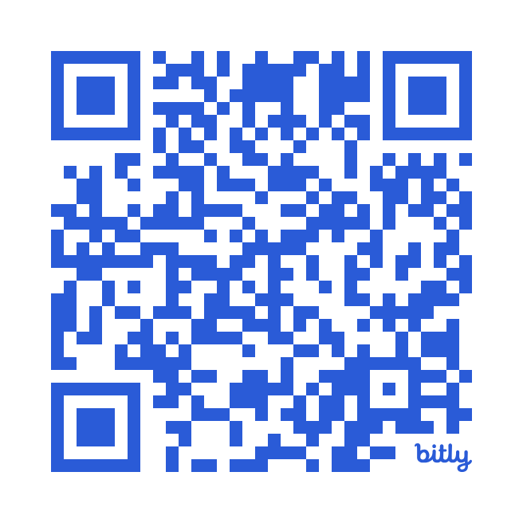

# Memilih Uji Statistik yang Tepat {.unnumbered}

::: {.content-visible when-format="html"}
Bagian ini menyajikan *decision tree* interaktif untuk membantu Anda memilih uji statistik yang tepat. Jawablah pertanyaan yang muncul secara bertahap, mulai dari jumlah dan jenis variabel, desain penelitian, hingga karakteristik data, dengan mengklik opsi yang tersedia. Setiap pilihan akan mengarahkan Anda ke langkah berikutnya sampai diperoleh rekomendasi uji statistik yang sesuai. Gunakan tombol *Kembali* untuk meninjau ulang keputusan, atau *Reset* untuk mencoba skenario analisis yang berbeda. Simulasi ini dirancang sebagai sarana pembelajaran untuk melatih cara berpikir statistik secara sistematis sebelum melakukan analisis data sesungguhnya.

```{=html}
<!doctype html>
<html lang="id">
<head>
  <meta charset="utf-8" />
  <meta name="viewport" content="width=device-width, initial-scale=1" />
  <title>Decision Tree Statistik</title>
  <style>
    /* v2.9 — Sinkron panjang box & estetika tepi
       - Gunakan satu lebar baku: --box-max untuk .question & .choices
       - Tambah box-sizing:border-box pada SEMUA kartu & tombol agar padding+border dihitung dalam lebar
       - Samakan radius & padding, plus overflow:hidden pada .choices agar efek bayangan/rounded tidak keluar
       - Tetap 2 bagian (Pertanyaan & Pilihan), animasi Back/Reset, tema terang
    */

    :root{
      --bg: #ffffff;
      --paper: #ffffff;
      --text: #0f172a;
      --muted: #334155;
      --border: #e2e8f0;
      --primary: #1d4ed8;
      --primary-ghost: #eff6ff;
      --shadow: 0 6px 22px rgba(2, 6, 23, .08);
      --pink: #fce7f3;
      --pinkBorder: #f472b6;
      /* Ubah lebar komponen utama di sini */
      --box-max: 620px;
      --card-radius: 14px;
      --btn-radius: 12px;
      --block-pad-x: 16px; /* padding horizontal seragam */
    }

    *{box-sizing:border-box}
    html,body{height:100%}
    body{margin:0;font-family:Inter, system-ui, -apple-system, Segoe UI, Roboto, Ubuntu, Arial, sans-serif;background:var(--bg);color:var(--text)}

    .wrap{max-width:860px;margin:28px auto;padding:16px}
    h1{font-size:24px;margin:0 0 8px;font-weight:800}
    .muted{color:var(--muted)}

    .stage{border:1px solid var(--border);border-radius:16px;background:var(--paper);box-shadow:var(--shadow);padding:18px}

    /* Dua BAGIAN saja */
    .question{max-width:var(--box-max);margin:0 auto 14px;border:1px solid var(--border);border-radius:var(--card-radius);background:linear-gradient(180deg,#fff,#f8fafc);padding:16px var(--block-pad-x)}
    .question h2{font-size:18px;margin:0 0 6px;font-weight:800}

    .choices{max-width:var(--box-max);margin:0 auto;border:1px solid var(--border);border-radius:var(--card-radius);background:#fff;padding:12px var(--block-pad-x);overflow:hidden} /* overflow menjaga rounded rapih */

    /* TOMBOL PILIHAN = full width di dalam .choices, tidak melebihi container */
    .choice{all:unset;display:block;width:100%;padding:12px 14px;border:1px solid var(--border);border-radius:var(--btn-radius);background:#fff;cursor:pointer;transition:transform .12s ease, box-shadow .12s ease, border-color .12s ease}
    .choice+.choice{margin-top:10px}
    .choice:hover{transform:translateY(-1px);box-shadow:0 6px 14px rgba(29,78,216,.12);border-color:var(--primary)}
    .choice:focus-visible{outline:3px solid var(--primary);outline-offset:1px}

    /* DECISION akhir: latar pink */
    .decisionBanner{font-size:12px;font-weight:700;letter-spacing:.3px;color:#9d174d;margin:0 0 8px;text-transform:uppercase}
    .decision{border:2px solid var(--pinkBorder);background:linear-gradient(180deg,var(--pink),#ffe4f3)}

    /* Toolbar bawah */
    .toolbar{display:flex;gap:10px;justify-content:flex-end;margin-top:16px}
    .btn{all:unset;display:inline-block;padding:9px 12px;border:1px solid var(--border);border-radius:10px;background:#fff;cursor:pointer}
    .btn:hover{box-shadow:0 6px 14px rgba(29,78,216,.12)}
    .btn.primary{border-color:var(--primary)}

    /* Animasi geser */
    .slide-enter{animation:slideIn .25s ease both}
    .slide-exit{animation:slideOut .25s ease both}
    @keyframes slideIn{from{opacity:0;transform:translateX(22px)}to{opacity:1;transform:translateX(0)}}
    @keyframes slideOut{from{opacity:1;transform:translateX(0)}to{opacity:0;transform:translateX(-22px)}}
  </style>
</head>
<body>
  <div class="wrap">
    <h4><i>Decision Tree </i> Analisis Statistik</h4>

    <div id="stage" class="stage"></div>

    <div class="toolbar">
      <button id="backBtn" class="btn">Kembali</button>
      <button id="resetBtn" class="btn primary">Reset</button>
    </div>

    <p class="muted" style="font-size:12px;margin-top:12px">Catatan: simulasi ini hanya alat bantu edukatif; tetap perhatikan rancangan studi, kualitas data, dan pemenuhan asumsi sebelum menarik kesimpulan.</p>
  </div>

  <script>
  // ====== DATA POHON (S1) ======
  const NODES = {
    Q_OUTCOME_COUNT: { id:'Q_OUTCOME_COUNT', kind:'question', title:'Berapa jumlah variabel terikat?', note:'Pilih satu', options:[
      {label:'Satu', next:'Q_OUTCOME_TYPE'},
      {label:'Lebih dari satu', next:'R_OOS_MV'},
    ]},
    Q_OUTCOME_TYPE: { id:'Q_OUTCOME_TYPE', kind:'question', title:'Tipe variabel terikat?', options:[
      {label:'Kontinyu (interval/rasio)', next:'Q_PREDICTOR_COUNT'},
      {label:'Kategorik/Nominal', next:'Q_CAT_OUTCOME_FLOW'},
    ]},
    Q_PREDICTOR_COUNT: { id:'Q_PREDICTOR_COUNT', kind:'question', title:'Berapa jumlah variabel bebas?', options:[
      {label:'Satu', next:'Q_PREDICTOR_TYPE_ONE'},
      {label:'Dua atau lebih', next:'Q_PREDICTOR_TYPE_MULTI'},
    ]},
    Q_PREDICTOR_TYPE_ONE: { id:'Q_PREDICTOR_TYPE_ONE', kind:'question', title:'Tipe variabel bebas?', options:[
      {label:'Kontinyu', next:'Q_ASSUMP_CORR'},
      {label:'Kategorik', next:'Q_CAT_DETAILS_ONE'},
    ]},
    Q_CAT_DETAILS_ONE: { id:'Q_CAT_DETAILS_ONE', kind:'question', title:'Jika variabel bebas kategorikal: kategori & desain?', options:[
      {label:'2 kategori — sampel independen', next:'Q_ASSUMP_2IND'},
      {label:'2 kategori — sampel berpasangan', next:'Q_ASSUMP_2PAIRED'},
      {label:'>2 kategori — sampel independen', next:'Q_ASSUMP_KINDEP'},
      {label:'>2 kategori — sampel berpasangan', next:'Q_ASSUMP_KPAIRED'},
    ]},
    Q_PREDICTOR_TYPE_MULTI: { id:'Q_PREDICTOR_TYPE_MULTI', kind:'question', title:'Komposisi variabel?', options:[
      {label:'Semua kontinyu', next:'R_LM'},
      {label:'Semua kategorikal', next:'R_LM'},
      {label:'Campuran (kontinyu + kategorikal)', next:'R_LM'},
    ]},
    Q_CAT_OUTCOME_FLOW: { id:'Q_CAT_OUTCOME_FLOW', kind:'question', title:'Untuk variabel terikat kategorikal, pilih alur:', options:[
      {label:'Uji asosiasi antar variabel kategorikal', next:'Q_CAT_ASSOC'},
      {label:'Prediksi variabel terikat kategorikal (logistik/ordinal)', next:'R_OOS_CAT_OUTCOME'},
    ]},
    Q_CAT_ASSOC: { id:'Q_CAT_ASSOC', kind:'question', title:'Desain untuk variabel kategorikal?', options:[
      {label:'Sampel independen', next:'R_CHI2'},
      {label:'Sampel berpasangan, biner (2×2, pre–post)', next:'R_MCNEMAR'},
      {label:'Sampel berpasangan, >2 kondisi (biner berulang)', next:'R_COCHRAN_Q'},
    ]},
    // Asumsi parametrik
    Q_ASSUMP_2IND: { id:'Q_ASSUMP_2IND', kind:'question', title:'Asumsi parametrik terpenuhi? (normalitas & homogenitas varians)', options:[
      {label:'Ya', next:'R_TTEST_INDEP'},
      {label:'Tidak', next:'R_MWU'},
    ]},
    Q_ASSUMP_2PAIRED: { id:'Q_ASSUMP_2PAIRED', kind:'question', title:'Asumsi parametrik terpenuhi? (selisih skor ~ normal)', options:[
      {label:'Ya', next:'R_TTEST_PAIRED'},
      {label:'Tidak', next:'R_WILCOXON'},
    ]},
    Q_ASSUMP_KINDEP: { id:'Q_ASSUMP_KINDEP', kind:'question', title:'Asumsi parametrik terpenuhi? (normalitas residual & homogenitas varians)', options:[
      {label:'Ya', next:'R_ANOVA_1W'},
      {label:'Tidak', next:'R_KW'},
    ]},
    Q_ASSUMP_KPAIRED: { id:'Q_ASSUMP_KPAIRED', kind:'question', title:'Asumsi parametrik terpenuhi? (sphericity/normalitas residual)', options:[
      {label:'Ya', next:'R_ANOVA_RM'},
      {label:'Tidak', next:'R_FRIEDMAN'},
    ]},
    Q_ASSUMP_CORR: { id:'Q_ASSUMP_CORR', kind:'question', title:'Asumsi parametrik terpenuhi? (normalitas)', options:[
      {label:'Ya', next:'R_PEARSON'},
      {label:'Tidak', next:'R_SPEARMAN_KENDALL'},
    ]},
    // Hasil
    R_TTEST_INDEP: { id:'R_TTEST_INDEP', kind:'result', title:'t-test Independen' },
    R_MWU: { id:'R_MWU', kind:'result', title:'Mann–Whitney U' },
    R_TTEST_PAIRED: { id:'R_TTEST_PAIRED', kind:'result', title:'t-test Berpasangan' },
    R_WILCOXON: { id:'R_WILCOXON', kind:'result', title:'Wilcoxon Signed-Rank' },
    R_ANOVA_1W: { id:'R_ANOVA_1W', kind:'result', title:'One-way ANOVA' },
    R_KW: { id:'R_KW', kind:'result', title:'Kruskal–Wallis' },
    R_ANOVA_RM: { id:'R_ANOVA_RM', kind:'result', title:'Repeated-Measures ANOVA' },
    R_FRIEDMAN: { id:'R_FRIEDMAN', kind:'result', title:'Friedman Test' },
    R_PEARSON: { id:'R_PEARSON', kind:'result', title:'Korelasi Pearson r' },
    R_SPEARMAN_KENDALL: { id:'R_SPEARMAN_KENDALL', kind:'result', title:'Korelasi Spearman ρ / Kendall τ' },
    R_POINT_BISERIAL: { id:'R_POINT_BISERIAL', kind:'result', title:'Point-biserial r' },
    R_CHI2: { id:'R_CHI2', kind:'result', title:'Chi-square (Independence)' },
    R_MCNEMAR: { id:'R_MCNEMAR', kind:'result', title:'McNemar Test' },
    R_COCHRAN_Q: { id:'R_COCHRAN_Q', kind:'result', title:"Cochran's Q" },
    R_LM: { id:'R_LM', kind:'result', title:'Regresi Linear (Simple & Multiple)' },
    R_OOS_MV: { id:'R_OOS_MV', kind:'result', title:'Di Luar Cakupan S1 (MANOVA/MANCOVA)' },
    R_OOS_CAT_OUTCOME: { id:'R_OOS_CAT_OUTCOME', kind:'result', title:'Di luar cakupan  materi S1 (Logistik/Ordinal/Multikelas)' },
  };

  // ====== STATE & RENDER ======
  const stage = document.getElementById('stage');
  const backBtn = document.getElementById('backBtn');
  const resetBtn = document.getElementById('resetBtn');
  const history = [];

  const h = (tag, cls, html) => { const e=document.createElement(tag); if(cls) e.className=cls; if(html!=null) e.innerHTML=html; return e; };

  function current(){ return history.length ? NODES[ history[history.length-1] ] : null; }
  function start(){ history.splice(0,history.length,'Q_OUTCOME_COUNT'); render(); }
  function choose(nextId){ history.push(nextId); render(true); }
  function back(){ if(history.length>1){ history.pop(); render(true,'back'); } }
  function reset(){ start(); stage.classList.add('slide-exit'); setTimeout(()=>{ stage.classList.remove('slide-exit'); }, 180); }

  function render(withAnim=false, dir='forward'){
    const node = current() || NODES.Q_OUTCOME_COUNT;
    stage.innerHTML = '';

    if(node.kind==='question'){
      const q = h('div','question ' + (withAnim?'slide-enter':''));
      q.appendChild(h('h2',null,node.title));
      stage.appendChild(q);

      const choices = h('div','choices ' + (withAnim?'slide-enter':''));
      node.options.forEach(opt=>{
        const b = h('button','choice', `<strong>${opt.label}</strong>`);
        b.onclick = ()=> choose(opt.next);
        choices.appendChild(b);
      });
      stage.appendChild(choices);

    } else {
      const q = h('div','question decision ' + (withAnim?'slide-enter':''));
      q.innerHTML = `<div class="decisionBanner">Rekomendasi analisis</div><h2>${node.title}</h2>`;
      stage.appendChild(q);

      const choices = h('div','choices ' + (withAnim?'slide-enter':''));
      choices.innerHTML = '<div class="muted">Selesai. Gunakan tombol Reset untuk memulai kembali.</div>';
      stage.appendChild(choices);
    }

    backBtn.disabled = history.length<=1;
    if(dir==='back'){
      stage.classList.add('slide-exit');
      setTimeout(()=> stage.classList.remove('slide-exit'), 180);
    }
  }

  backBtn.addEventListener('click', ()=> back());
  resetBtn.addEventListener('click', ()=> reset());
  start();
  </script>
</body>
</html>
```
:::

::: {.content-visible when-format="pdf"}
Bagian ini mengarahkan pembaca ke media interaktif berbasis web untuk memilih uji statistik yang tepat. Melalui *decision tree* interaktif yang dapat diakses dengan memindai QR code di bawah, pembaca akan diajak menjawab pertanyaan-pertanyaan kunci mengenai jumlah dan jenis variabel, desain penelitian, serta karakteristik data. Setiap pilihan akan mengantarkan pembaca pada rekomendasi uji statistik yang sesuai. Simulasi ini dirancang untuk melatih cara berpikir statistik secara sistematis dan aplikatif sebelum melakukan analisis data.

Scan QR di bawah ini untuk membuka simulasi interaktif:

{width="5.5cm"}
:::
